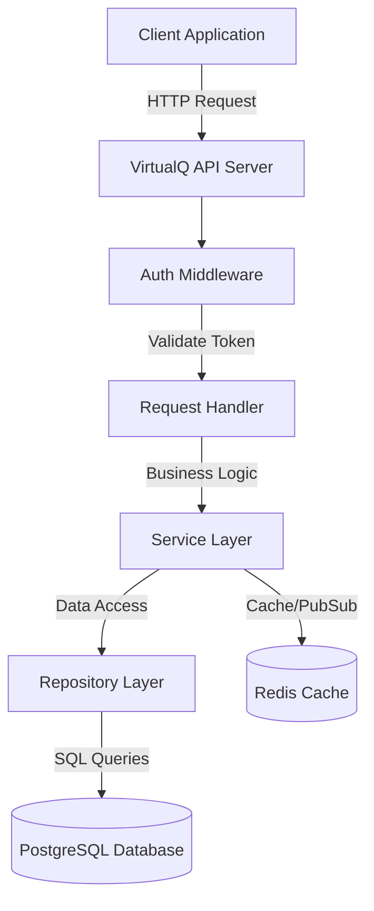

# Layered Architecture and Dependency Injection

The VirtualQ API follows a clean layered architecture with explicit dependency injection (no global variables).

## System Architecture



## Application Initialization Pattern

**Fail-Fast Startup Philosophy**

The application follows a fail-fast initialization pattern where all critical dependencies are verified during startup before accepting traffic. This approach provides several benefits:

1. **Immediate Failure Detection**
   - Catch configuration errors before deployment completes
   - Prevent partial service availability (zombie services)
   - Kubernetes/orchestrators can detect failed pods immediately
   - Reduces mean time to detection (MTTD) from minutes to seconds

2. **Clear Error Messages**
   - Startup failures provide specific error context (which dependency failed)
   - Easier debugging than cryptic runtime errors
   - Logs show exactly what's wrong before any requests are processed

3. **Operational Safety**
   - Health checks pass only when service is truly ready
   - Load balancers don't route traffic to broken instances
   - Prevents cascading failures from unhealthy dependencies
   - Database connection pool exhaustion is caught early

4. **Development Experience**
   - Developers know immediately if local setup is broken
   - CI/CD pipelines fail fast on misconfiguration
   - No silent failures that manifest later under load

**Why Ping Database and Redis?**

- `pgxpool.New()` creates a connection pool but doesn't verify connectivity
- Pool is lazy - actual connections happen on first query
- Ping forces an immediate connection attempt with timeout
- Schema version check ensures migrations have run
- Redis ping verifies cache/pub-sub is available

Without these checks, the server would start successfully but fail on first request, making debugging harder and potentially passing health checks when it shouldn't.

See the complete initialization code in the next section.

## Layer Responsibilities

### Handler Layer (HTTP Controllers)
**Location**: `internal/api/handlers/`

**Responsibilities**:
- Parse and validate HTTP requests (query params, path params, request body)
- Extract authentication and tenant context from headers
- Call appropriate service methods
- Map service responses to HTTP responses (status codes, JSON)
- Handle HTTP-specific concerns (CORS, content negotiation)

### Service Layer (Business Logic)
**Location**: `internal/services/`

**Responsibilities**:
- Implement core business logic and workflows
- Coordinate between multiple repositories
- Enforce business rules and validation (state machine transitions, custom_data schemas)
- Handle cross-cutting concerns (multi-tenant isolation, authorization)
- Manage transactions across multiple database operations
- Publish events to Redis for real-time updates
- Return domain errors (not HTTP errors)

### Repository Layer (Data Access)
**Location**: `internal/repository/`

**Responsibilities**:
- Execute database queries using sqlc-generated code
- Map database rows to domain models
- Handle database-specific errors
- Provide clean interface for data operations
- No business logic (pure data access)

## Benefits

- **Readability** - main() is now 10 lines instead of 100+
- **Testability** - Each initialization function can be tested independently
- **Reusability** - Functions can be reused in test setup
- **Clear Separation** - Infrastructure vs application vs server concerns
- **Type Safety** - Repositories, Services, and Handlers structs group related components
- **Maintainability** - Easy to add new handlers/services without touching main()


## Complete Initialization Code

```go
// cmd/server/main.go
func main() {
    cfg := config.Load()
    logger := initLogger(cfg)
    
    // Initialize infrastructure
    dbPool := initDatabase(cfg, logger)
    defer dbPool.Close()
    
    redisClient := initRedis(cfg, logger)
    defer redisClient.Close()
    
    // Build application
    app := buildApplication(dbPool, redisClient, logger)
    
    // Start server
    startServer(app, cfg, logger)
}

func initLogger(cfg *config.Config) *slog.Logger {
    return slog.New(slog.NewJSONHandler(os.Stdout, &slog.HandlerOptions{
        Level: cfg.LogLevel,
    }))
}

func initDatabase(cfg *config.Config, logger *slog.Logger) *pgxpool.Pool {
    ctx, cancel := context.WithTimeout(context.Background(), 10*time.Second)
    defer cancel()
    
    // Create connection pool
    dbPool, err := pgxpool.New(ctx, cfg.DatabaseURL)
    if err != nil {
        logger.Error("failed to create database pool", "error", err)
        os.Exit(1)
    }
    
    // Verify connectivity
    if err := dbPool.Ping(ctx); err != nil {
        logger.Error("database ping failed", "error", err)
        os.Exit(1)
    }
    logger.Info("database connection verified")
    
    // Verify schema version (optional but recommended)
    var schemaVersion int
    err = dbPool.QueryRow(ctx, "SELECT version FROM schema_migrations ORDER BY version DESC LIMIT 1").Scan(&schemaVersion)
    if err != nil {
        logger.Warn("could not verify schema version", "error", err)
    } else {
        logger.Info("database schema verified", "version", schemaVersion)
    }
    
    return dbPool
}

func initRedis(cfg *config.Config, logger *slog.Logger) *redis.Client {
    ctx, cancel := context.WithTimeout(context.Background(), 5*time.Second)
    defer cancel()
    
    client := redis.NewClient(&redis.Options{
        Addr: cfg.RedisURL,
    })
    
    // Verify connectivity
    if err := client.Ping(ctx).Err(); err != nil {
        logger.Error("redis ping failed", "error", err)
        os.Exit(1)
    }
    logger.Info("redis connection verified")
    
    return client
}

type Application struct {
    Router   *gin.Engine
    Handlers *Handlers
}

func buildApplication(dbPool *pgxpool.Pool, redisClient *redis.Client, logger *slog.Logger) *Application {
    // Initialize data access layer
    queries := db.New(dbPool)
    repos := initRepositories(queries, logger)
    
    // Initialize business logic layer
    services := initServices(repos, redisClient, logger)
    
    // Initialize HTTP layer
    handlers := initHandlers(services, logger)
    
    // Setup router with middleware
    router := setupRouter(logger)
    
    // Register routes
    registerRoutes(router, handlers)
    
    return &Application{
        Router:   router,
        Handlers: handlers,
    }
}

func initRepositories(queries *db.Queries, logger *slog.Logger) *Repositories {
    return &Repositories{
        Tenant:         repository.NewTenantRepository(queries, logger),
        Ticket:         repository.NewTicketRepository(queries, logger),
        TypeDefinition: repository.NewTypeDefinitionRepository(queries, logger),
        Queue:          repository.NewQueueRepository(queries, logger),
    }
}

type Repositories struct {
    Tenant         *repository.TenantRepository
    Ticket         *repository.TicketRepository
    TypeDefinition *repository.TypeDefinitionRepository
    Queue          *repository.QueueRepository
}

func initServices(repos *Repositories, redisClient *redis.Client, logger *slog.Logger) *Services {
    return &Services{
        Tenant: services.NewTenantService(repos.Tenant, logger),
        Ticket: services.NewTicketService(
            repos.Ticket,
            repos.TypeDefinition,
            repos.Queue,
            redisClient,
            logger,
        ),
    }
}

type Services struct {
    Tenant *services.TenantService
    Ticket *services.TicketService
}

func initHandlers(services *Services, logger *slog.Logger) *Handlers {
    return &Handlers{
        Tenant: handlers.NewTenantHandler(services.Tenant, logger),
        Ticket: handlers.NewTicketHandler(services.Ticket, logger),
    }
}

type Handlers struct {
    Tenant *handlers.TenantHandler
    Ticket *handlers.TicketHandler
}

func setupRouter(logger *slog.Logger) *gin.Engine {
    router := gin.New()
    
    // Global middleware
    router.Use(middleware.Logger(logger))
    router.Use(middleware.Recovery(logger))
    router.Use(middleware.RequestID())
    router.Use(middleware.CORS())
    
    return router
}

func registerRoutes(router *gin.Engine, handlers *Handlers) {
    v1 := router.Group("/v1")
    {
        // Tenant routes
        tenants := v1.Group("/tenants")
        tenants.Use(middleware.TenantContext())
        {
            tenants.GET("", handlers.Tenant.List)
            tenants.POST("", handlers.Tenant.Create)
            tenants.GET("/:id", handlers.Tenant.Get)
            tenants.PUT("/:id", handlers.Tenant.Update)
        }
        
        // Ticket routes
        tickets := v1.Group("/tickets")
        tickets.Use(middleware.TenantContext())
        {
            tickets.GET("", handlers.Ticket.List)
            tickets.POST("", handlers.Ticket.Create)
            tickets.GET("/:id", handlers.Ticket.Get)
            tickets.POST("/:id/transition", handlers.Ticket.Transition)
        }
    }
}

func startServer(app *Application, cfg *config.Config, logger *slog.Logger) {
    addr := ":" + cfg.Port
    logger.Info("starting server", 
        "port", cfg.Port,
        "env", cfg.Environment,
    )
    
    if err := app.Router.Run(addr); err != nil {
        logger.Error("server failed to start", "error", err)
        os.Exit(1)
    }
}
```

## Layer Implementation Examples

### Handler Layer Example

```go
type TicketHandler struct {
    ticketService *services.TicketService
    logger        *slog.Logger
}

func NewTicketHandler(ticketService *services.TicketService, logger *slog.Logger) *TicketHandler {
    return &TicketHandler{
        ticketService: ticketService,
        logger:        logger,
    }
}

func (h *TicketHandler) CreateTicket(c *gin.Context) {
    var req CreateTicketRequest
    if err := c.ShouldBindJSON(&req); err != nil {
        c.JSON(400, ErrorResponse{Error: "validation_error", Message: err.Error()})
        return
    }
    
    ctx := c.Request.Context()
    tenantID := middleware.MustGetTenantID(ctx)
    
    ticket, err := h.ticketService.CreateTicket(ctx, tenantID, req)
    if err != nil {
        h.logger.ErrorContext(ctx, "failed to create ticket", 
            "error", err, 
            "tenant_id", tenantID,
        )
        c.JSON(mapErrorToStatus(err), toErrorResponse(err))
        return
    }
    
    h.logger.InfoContext(ctx, "ticket created", 
        "ticket_id", ticket.ID, 
        "tenant_id", tenantID,
    )
    c.JSON(201, ticket)
}
```

### Service Layer Example

```go
type TicketService struct {
    ticketRepo     *repository.TicketRepository
    typeDefRepo    *repository.TypeDefinitionRepository
    queueRepo      *repository.QueueRepository
    redisClient    *redis.Client
    logger         *slog.Logger
}

func NewTicketService(
    ticketRepo *repository.TicketRepository,
    typeDefRepo *repository.TypeDefinitionRepository,
    queueRepo *repository.QueueRepository,
    redisClient *redis.Client,
    logger *slog.Logger,
) *TicketService {
    return &TicketService{
        ticketRepo:  ticketRepo,
        typeDefRepo: typeDefRepo,
        queueRepo:   queueRepo,
        redisClient: redisClient,
        logger:      logger,
    }
}

func (s *TicketService) CreateTicket(ctx context.Context, tenantID int64, req CreateTicketRequest) (*Ticket, error) {
    // Business logic implementation
    typeDef, err := s.typeDefRepo.GetByID(ctx, req.TypeDefinitionID)
    if err != nil {
        s.logger.ErrorContext(ctx, "type definition not found",
            "tenant_id", tenantID,
            "type_definition_id", req.TypeDefinitionID,
            "error", err,
        )
        return nil, fmt.Errorf("type definition not found: %w", err)
    }
    
    // Validate custom_data against JSON schema
    if err := validateCustomData(req.CustomData, typeDef.CustomFieldsSchema); err != nil {
        s.logger.WarnContext(ctx, "invalid custom data",
            "tenant_id", tenantID,
            "error", err,
        )
        return nil, fmt.Errorf("invalid custom data: %w", err)
    }
    
    // Create ticket
    ticket, err := s.ticketRepo.Create(ctx, tenantID, req)
    if err != nil {
        return nil, err
    }
    
    // Publish event
    s.redisClient.Publish(ctx, "ticket.created", ticket.ID)
    
    s.logger.InfoContext(ctx, "ticket created", 
        "ticket_id", ticket.ID, 
        "tenant_id", tenantID,
    )
    return ticket, nil
}
```

### Repository Layer Example

```go
type TicketRepository struct {
    queries *db.Queries // sqlc generated
    logger  *slog.Logger
}

func NewTicketRepository(queries *db.Queries, logger *slog.Logger) *TicketRepository {
    return &TicketRepository{
        queries: queries,
        logger:  logger,
    }
}

func (r *TicketRepository) Create(ctx context.Context, tenantID int64, params CreateTicketParams) (*Ticket, error) {
    // Use sqlc-generated query
    dbTicket, err := r.queries.CreateTicket(ctx, db.CreateTicketParams{
        QueueID:          params.QueueID,
        TypeDefinitionID: params.TypeDefinitionID,
        TenantID:         tenantID,
        CustomData:       params.CustomData,
    })
    if err != nil {
        r.logger.ErrorContext(ctx, "failed to create ticket", 
            "error", err, 
            "tenant_id", tenantID,
        )
        return nil, err
    }
    
    return mapToTicket(dbTicket), nil
}
```
