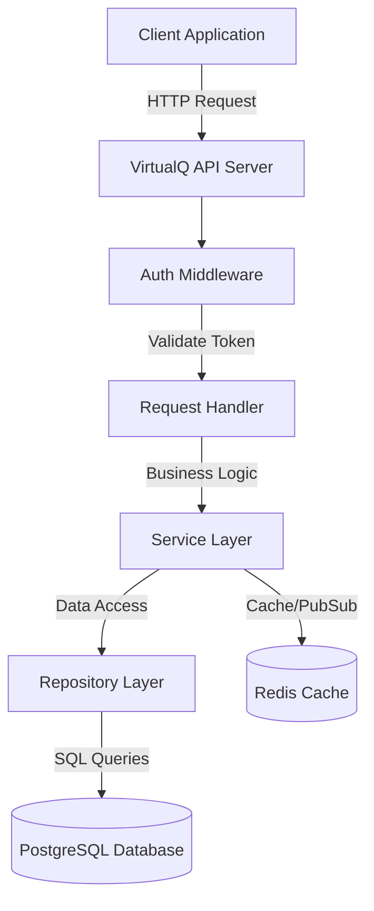
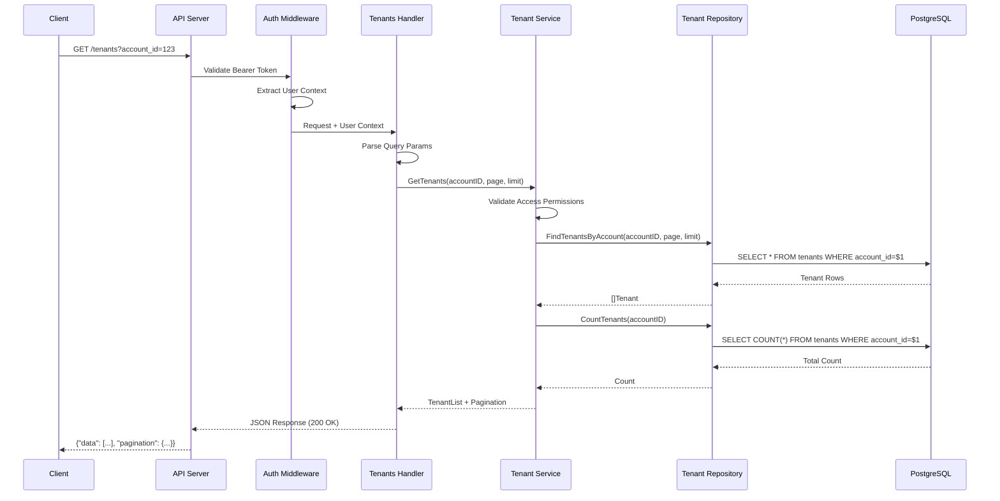
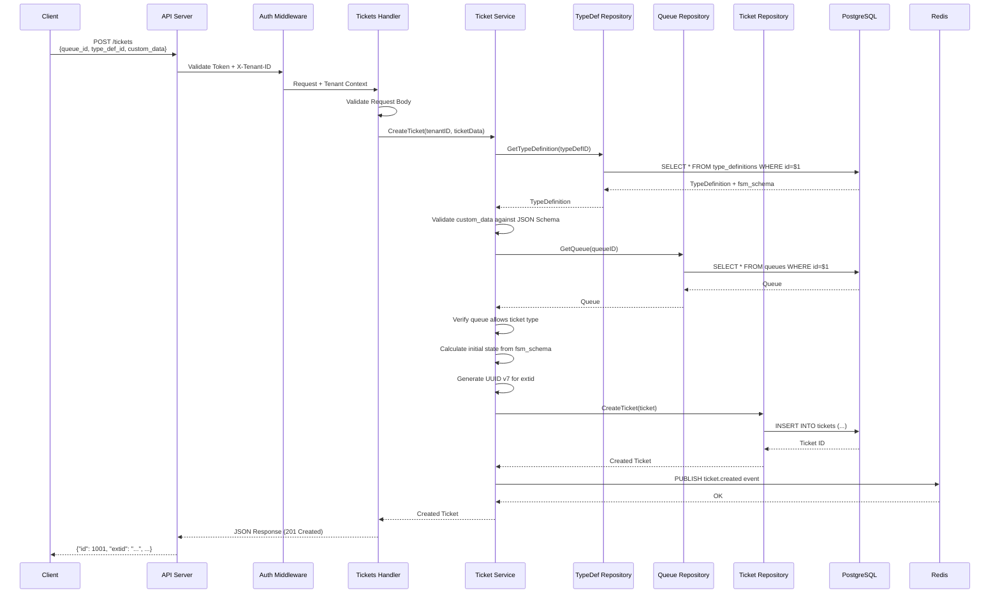
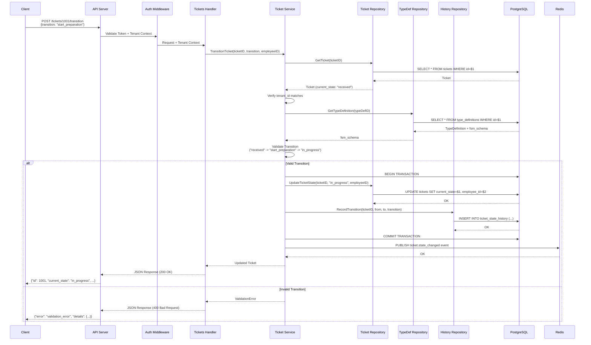

# API Design Document

## Overview

The VirtualQ REST API provides comprehensive queue management capabilities through a metadata-driven architecture. The API supports multi-tenant isolation, configurable workflows, and real-time state management.

## Architecture

### API Design Principles
- **RESTful**: Standard HTTP methods and status codes
- **Multi-tenant**: Tenant context required for data isolation
- **Metadata-driven**: Behavior controlled by TypeDefinition configurations
- **Real-time**: Webhook support for immediate updates
- **Consistent**: Uniform error handling and response formats

### Base URL Structure
```
https://api.virtualqueue.example.com/v1
```

### Authentication
- Bearer token authentication
- API key support for service-to-service calls
- Tenant context via X-Tenant-ID header or query parameter

## Components and Interfaces

### System Architecture



### Layered Architecture and Dependency Injection

The VirtualQ API follows a clean layered architecture with explicit dependency injection (no global variables).

#### Context-Based Tenant Isolation

**Why Context for Tenant ID?**

In multi-tenant systems, tenant_id is the most critical piece of security and operational data. We use Go's `context.Context` to propagate tenant_id through all layers for several architectural reasons:

1. **Security by Design**
   - Prevents accidental cross-tenant data access
   - Makes tenant isolation explicit at every layer
   - Enables audit trails for compliance (GDPR, SOC2, HIPAA)
   - Allows detection of tenant mismatch attacks

2. **Observability**
   - Every log statement can include tenant_id automatically
   - Distributed tracing can track requests across services by tenant
   - Metrics can be segmented by tenant for billing and monitoring
   - Debugging production issues requires knowing which tenant

3. **Operational Benefits**
   - Query filtering by tenant at database level
   - Rate limiting per tenant
   - Feature flags per tenant
   - Performance monitoring per tenant
   - Incident response (isolate affected tenants)

4. **Architectural Clarity**
   - Explicit parameter passing makes data flow obvious
   - No hidden global state or thread-local variables
   - Testable (mock context with test tenant_id)
   - Forces developers to think about multi-tenancy

**Why Not Global Variables or Thread-Local Storage?**

- Go's concurrency model (goroutines) makes thread-local storage unreliable
- Global state is untestable and creates hidden dependencies
- Context makes the dependency explicit in function signatures
- Context cancellation propagates through the call stack

**Implementation Pattern:**

Multi-tenant context (tenant_id, request_id) is stored in `context.Context` and flows through all layers:

```go
// internal/middleware/tenant.go
type contextKey string

const (
    tenantIDKey  contextKey = "tenant_id"
    requestIDKey contextKey = "request_id"
)

// Middleware extracts tenant_id and adds to context
func TenantContext() gin.HandlerFunc {
    return func(c *gin.Context) {
        // Extract from header or query param
        tenantIDStr := c.GetHeader("X-Tenant-ID")
        if tenantIDStr == "" {
            tenantIDStr = c.Query("tenant_id")
        }
        
        if tenantIDStr == "" {
            c.JSON(400, ErrorResponse{
                Error:   "validation_error",
                Message: "tenant_id required",
            })
            c.Abort()
            return
        }
        
        tenantID, err := strconv.ParseInt(tenantIDStr, 10, 64)
        if err != nil {
            c.JSON(400, ErrorResponse{
                Error:   "validation_error",
                Message: "invalid tenant_id",
            })
            c.Abort()
            return
        }
        
        // Verify user has access to this tenant (authorization check)
        userID := c.GetInt64("user_id") // From auth middleware
        if !hasAccessToTenant(userID, tenantID) {
            c.JSON(403, ErrorResponse{
                Error:   "forbidden",
                Message: "Access denied to tenant",
            })
            c.Abort()
            return
        }
        
        // Add to context for downstream use
        ctx := context.WithValue(c.Request.Context(), tenantIDKey, tenantID)
        c.Request = c.Request.WithContext(ctx)
        
        c.Next()
    }
}

// Helper to extract tenant_id from context
func GetTenantID(ctx context.Context) (int64, bool) {
    tenantID, ok := ctx.Value(tenantIDKey).(int64)
    return tenantID, ok
}

// Helper to extract request_id from context
func GetRequestID(ctx context.Context) string {
    requestID, _ := ctx.Value(requestIDKey).(string)
    return requestID
}
}
```

**Context Flow Through Layers:**

```
HTTP Request with X-Tenant-ID: 456
    ↓
[Middleware] Extract tenant_id → Add to context.Context
    ↓
[Handler] Extract from context → Pass to service
    ↓
[Service] Use tenant_id for:
    - Business logic validation
    - Logging with tenant context
    - Pass to repository
    ↓
[Repository] Use tenant_id for:
    - SQL WHERE tenant_id = $1 clauses
    - Logging with tenant context
    - Data isolation enforcement
    ↓
[Database] Query scoped to tenant_id
```

**Example: Context Flow in Practice**

```go
// Handler extracts from context
func (h *TicketHandler) GetTicket(c *gin.Context) {
    ctx := c.Request.Context()
    tenantID := middleware.MustGetTenantID(ctx) // From context
    ticketID, _ := strconv.ParseInt(c.Param("id"), 10, 64)
    
    // Pass context down (contains tenant_id, request_id, cancellation)
    ticket, err := h.ticketService.GetTicket(ctx, tenantID, ticketID)
    if err != nil {
        h.logger.ErrorContext(ctx, "failed to get ticket",
            "tenant_id", tenantID,  // Explicit for clarity
            "ticket_id", ticketID,
        )
        c.JSON(mapError(err))
        return
    }
    
    c.JSON(200, ticket)
}

// Service uses tenant_id for validation and logging
func (s *TicketService) GetTicket(ctx context.Context, tenantID, ticketID int64) (*Ticket, error) {
    // Context carries tenant_id, request_id, and cancellation signals
    ticket, err := s.ticketRepo.GetByID(ctx, tenantID, ticketID)
    if err != nil {
        return nil, err
    }
    
    // Verify tenant ownership (defense in depth)
    if ticket.TenantID != tenantID {
        s.logger.WarnContext(ctx, "tenant mismatch detected",
            "requested_tenant_id", tenantID,
            "ticket_tenant_id", ticket.TenantID,
            "ticket_id", ticketID,
        )
        return nil, apperrors.NewForbiddenError("Access denied")
    }
    
    return ticket, nil
}

// Repository enforces tenant isolation at database level
func (r *TicketRepository) GetByID(ctx context.Context, tenantID, ticketID int64) (*Ticket, error) {
    // SQL query MUST include tenant_id in WHERE clause
    ticket, err := r.queries.GetTicketByIDAndTenant(ctx, db.GetTicketByIDAndTenantParams{
        ID:       ticketID,
        TenantID: tenantID,  // Enforces data isolation
    })
    if err != nil {
        if errors.Is(err, pgx.ErrNoRows) {
            r.logger.DebugContext(ctx, "ticket not found",
                "tenant_id", tenantID,
                "ticket_id", ticketID,
            )
            return nil, apperrors.NewNotFoundError("ticket", ticketID)
        }
        r.logger.ErrorContext(ctx, "database error",
            "tenant_id", tenantID,
            "ticket_id", ticketID,
            "error", err,
        )
        return nil, apperrors.NewInternalError(err)
    }
    
    return mapToTicket(ticket), nil
}
```

**Why Pass tenant_id Explicitly AND in Context?**

We pass `tenant_id` as an explicit parameter even though it's in context because:

1. **Function Signature Clarity** - Makes tenant requirement obvious
2. **Type Safety** - Compile-time checking vs runtime context extraction
3. **Testing** - Easier to mock and test without context setup
4. **Documentation** - Self-documenting code
5. **Defense in Depth** - Multiple validation points prevent bugs

Context is still used for:
- Request cancellation propagation
- Distributed tracing spans
- Request-scoped values (request_id)
- Logging context enrichment

#### Application Initialization Pattern

**Fail-Fast Startup Philosophy**

The application follows a fail-fast initialization pattern where all critical dependencies are verified during startup before accepting traffic. This approach provides several benefits:

1. **Immediate Failure Detection**
   - Catch configuration errors before deployment completes
   - Prevent partial service availability (zombie services)
   - Kubernetes/orchestrators can detect failed pods immediately
   - Reduces mean time to detection (MTTD) from minutes to seconds

2. **Clear Error Messages**
   - Startup failures provide specific error context (which dependency failed)
   - Easier debugging than cryptic runtime errors
   - Logs show exactly what's wrong before any requests are processed

3. **Operational Safety**
   - Health checks pass only when service is truly ready
   - Load balancers don't route traffic to broken instances
   - Prevents cascading failures from unhealthy dependencies
   - Database connection pool exhaustion is caught early

4. **Development Experience**
   - Developers know immediately if local setup is broken
   - CI/CD pipelines fail fast on misconfiguration
   - No silent failures that manifest later under load

**Why Ping Database and Redis?**

- `pgxpool.New()` creates a connection pool but doesn't verify connectivity
- Pool is lazy - actual connections happen on first query
- Ping forces an immediate connection attempt with timeout
- Schema version check ensures migrations have run
- Redis ping verifies cache/pub-sub is available

Without these checks, the server would start successfully but fail on first request, making debugging harder and potentially passing health checks when it shouldn't.

```go
// cmd/server/main.go
func main() {
    cfg := config.Load()
    logger := initLogger(cfg)
    
    // Initialize infrastructure
    dbPool := initDatabase(cfg, logger)
    defer dbPool.Close()
    
    redisClient := initRedis(cfg, logger)
    defer redisClient.Close()
    
    // Build application
    app := buildApplication(dbPool, redisClient, logger)
    
    // Start server
    startServer(app, cfg, logger)
}

func initLogger(cfg *config.Config) *slog.Logger {
    return slog.New(slog.NewJSONHandler(os.Stdout, &slog.HandlerOptions{
        Level: cfg.LogLevel,
    }))
}

func initDatabase(cfg *config.Config, logger *slog.Logger) *pgxpool.Pool {
    ctx, cancel := context.WithTimeout(context.Background(), 10*time.Second)
    defer cancel()
    
    // Create connection pool
    dbPool, err := pgxpool.New(ctx, cfg.DatabaseURL)
    if err != nil {
        logger.Error("failed to create database pool", "error", err)
        os.Exit(1)
    }
    
    // Verify connectivity
    if err := dbPool.Ping(ctx); err != nil {
        logger.Error("database ping failed", "error", err)
        os.Exit(1)
    }
    logger.Info("database connection verified")
    
    // Verify schema version (optional but recommended)
    var schemaVersion int
    err = dbPool.QueryRow(ctx, "SELECT version FROM schema_migrations ORDER BY version DESC LIMIT 1").Scan(&schemaVersion)
    if err != nil {
        logger.Warn("could not verify schema version", "error", err)
    } else {
        logger.Info("database schema verified", "version", schemaVersion)
    }
    
    return dbPool
}

func initRedis(cfg *config.Config, logger *slog.Logger) *redis.Client {
    ctx, cancel := context.WithTimeout(context.Background(), 5*time.Second)
    defer cancel()
    
    client := redis.NewClient(&redis.Options{
        Addr: cfg.RedisURL,
    })
    
    // Verify connectivity
    if err := client.Ping(ctx).Err(); err != nil {
        logger.Error("redis ping failed", "error", err)
        os.Exit(1)
    }
    logger.Info("redis connection verified")
    
    return client
}

type Application struct {
    Router   *gin.Engine
    Handlers struct {
        Tenant *handlers.TenantHandler
        Ticket *handlers.TicketHandler
        // Add more handlers as needed
    }
}

func buildApplication(dbPool *pgxpool.Pool, redisClient *redis.Client, logger *slog.Logger) *Application {
    // Initialize data access layer
    queries := db.New(dbPool)
    repos := initRepositories(queries, logger)
    
    // Initialize business logic layer
    services := initServices(repos, redisClient, logger)
    
    // Initialize HTTP layer
    handlers := initHandlers(services, logger)
    
    // Setup router with middleware
    router := setupRouter(logger)
    
    // Register routes
    registerRoutes(router, handlers)
    
    return &Application{
        Router: router,
        Handlers: handlers,
    }
}

func initRepositories(queries *db.Queries, logger *slog.Logger) *Repositories {
    return &Repositories{
        Tenant:         repository.NewTenantRepository(queries, logger),
        Ticket:         repository.NewTicketRepository(queries, logger),
        TypeDefinition: repository.NewTypeDefinitionRepository(queries, logger),
        Queue:          repository.NewQueueRepository(queries, logger),
    }
}

type Repositories struct {
    Tenant         *repository.TenantRepository
    Ticket         *repository.TicketRepository
    TypeDefinition *repository.TypeDefinitionRepository
    Queue          *repository.QueueRepository
}

func initServices(repos *Repositories, redisClient *redis.Client, logger *slog.Logger) *Services {
    return &Services{
        Tenant: services.NewTenantService(repos.Tenant, logger),
        Ticket: services.NewTicketService(
            repos.Ticket,
            repos.TypeDefinition,
            repos.Queue,
            redisClient,
            logger,
        ),
    }
}

type Services struct {
    Tenant *services.TenantService
    Ticket *services.TicketService
}

func initHandlers(services *Services, logger *slog.Logger) *Handlers {
    return &Handlers{
        Tenant: handlers.NewTenantHandler(services.Tenant, logger),
        Ticket: handlers.NewTicketHandler(services.Ticket, logger),
    }
}

type Handlers struct {
    Tenant *handlers.TenantHandler
    Ticket *handlers.TicketHandler
}

func setupRouter(logger *slog.Logger) *gin.Engine {
    router := gin.New()
    
    // Global middleware
    router.Use(middleware.Logger(logger))
    router.Use(middleware.Recovery(logger))
    router.Use(middleware.RequestID())
    router.Use(middleware.CORS())
    
    return router
}

func registerRoutes(router *gin.Engine, handlers *Handlers) {
    v1 := router.Group("/v1")
    {
        // Tenant routes
        tenants := v1.Group("/tenants")
        tenants.Use(middleware.TenantContext())
        {
            tenants.GET("", handlers.Tenant.List)
            tenants.POST("", handlers.Tenant.Create)
            tenants.GET("/:id", handlers.Tenant.Get)
            tenants.PUT("/:id", handlers.Tenant.Update)
        }
        
        // Ticket routes
        tickets := v1.Group("/tickets")
        tickets.Use(middleware.TenantContext())
        {
            tickets.GET("", handlers.Ticket.List)
            tickets.POST("", handlers.Ticket.Create)
            tickets.GET("/:id", handlers.Ticket.Get)
            tickets.POST("/:id/transition", handlers.Ticket.Transition)
        }
    }
}

func startServer(app *Application, cfg *config.Config, logger *slog.Logger) {
    addr := ":" + cfg.Port
    logger.Info("starting server", 
        "port", cfg.Port,
        "env", cfg.Environment,
    )
    
    if err := app.Router.Run(addr); err != nil {
        logger.Error("server failed to start", "error", err)
        os.Exit(1)
    }
}
```

**Benefits of Refactored Structure:**

1. **Readability** - main() is now 10 lines instead of 100+
2. **Testability** - Each initialization function can be tested independently
3. **Reusability** - Functions can be reused in test setup
4. **Clear Separation** - Infrastructure vs application vs server concerns
5. **Type Safety** - Repositories, Services, and Handlers structs group related components
6. **Maintainability** - Easy to add new handlers/services without touching main()
```

#### Handler Layer (HTTP Controllers)
**Location**: `internal/api/handlers/`

**Responsibilities**:
- Parse and validate HTTP requests (query params, path params, request body)
- Extract authentication and tenant context from headers
- Call appropriate service methods
- Map service responses to HTTP responses (status codes, JSON)
- Handle HTTP-specific concerns (CORS, content negotiation)

**Dependency Injection**:
```go
type TicketHandler struct {
    ticketService *services.TicketService
    logger        *slog.Logger
}

func NewTicketHandler(ticketService *services.TicketService, logger *slog.Logger) *TicketHandler {
    return &TicketHandler{
        ticketService: ticketService,
        logger:        logger,
    }
}

func (h *TicketHandler) CreateTicket(c *gin.Context) {
    var req CreateTicketRequest
    if err := c.ShouldBindJSON(&req); err != nil {
        c.JSON(400, ErrorResponse{Error: "validation_error", Message: err.Error()})
        return
    }
    
    // Context already contains tenant_id from middleware
    ctx := c.Request.Context()
    tenantID := middleware.MustGetTenantID(ctx)
    
    ticket, err := h.ticketService.CreateTicket(ctx, req)
    if err != nil {
        h.logger.Error("failed to create ticket", "error", err, "tenant_id", tenantID)
        c.JSON(mapErrorToStatus(err), toErrorResponse(err))
        return
    }
    
    h.logger.Info("ticket created", "ticket_id", ticket.ID, "tenant_id", tenantID)
    c.JSON(201, ticket)
}
```

#### Service Layer (Business Logic)
**Location**: `internal/services/`

**Responsibilities**:
- Implement core business logic and workflows
- Coordinate between multiple repositories
- Enforce business rules and validation (state machine transitions, custom_data schemas)
- Handle cross-cutting concerns (multi-tenant isolation, authorization)
- Manage transactions across multiple database operations
- Publish events to Redis for real-time updates
- Return domain errors (not HTTP errors)

**Dependency Injection**:
```go
type TicketService struct {
    ticketRepo     *repository.TicketRepository
    typeDefRepo    *repository.TypeDefinitionRepository
    queueRepo      *repository.QueueRepository
    redisClient    *redis.Client
    logger         *slog.Logger
}

func NewTicketService(
    ticketRepo *repository.TicketRepository,
    typeDefRepo *repository.TypeDefinitionRepository,
    queueRepo *repository.QueueRepository,
    redisClient *redis.Client,
    logger *slog.Logger,
) *TicketService {
    return &TicketService{
        ticketRepo:  ticketRepo,
        typeDefRepo: typeDefRepo,
        queueRepo:   queueRepo,
        redisClient: redisClient,
        logger:      logger,
    }
}

func (s *TicketService) CreateTicket(ctx context.Context, req CreateTicketRequest) (*Ticket, error) {
    // Extract tenant_id from context
    tenantID := middleware.MustGetTenantID(ctx)
    
    // Business logic implementation
    typeDef, err := s.typeDefRepo.GetByID(ctx, req.TypeDefinitionID)
    if err != nil {
        return nil, fmt.Errorf("type definition not found: %w", err)
    }
    
    // Validate custom_data against JSON schema
    if err := validateCustomData(req.CustomData, typeDef.CustomFieldsSchema); err != nil {
        return nil, fmt.Errorf("invalid custom data: %w", err)
    }
    
    // Create ticket (repository extracts tenant_id from context)
    ticket, err := s.ticketRepo.Create(ctx, req)
    if err != nil {
        return nil, err
    }
    
    // Publish event
    s.redisClient.Publish(ctx, "ticket.created", ticket.ID)
    
    s.logger.Info("ticket created", "ticket_id", ticket.ID, "tenant_id", tenantID)
    return ticket, nil
}
```

#### Repository Layer (Data Access)
**Location**: `internal/repository/`

**Responsibilities**:
- Execute database queries using sqlc-generated code
- Map database rows to domain models
- Handle database-specific errors
- Provide clean interface for data operations
- No business logic (pure data access)

**Dependency Injection**:
```go
type TicketRepository struct {
    queries *db.Queries // sqlc generated
    logger  *slog.Logger
}

func NewTicketRepository(queries *db.Queries, logger *slog.Logger) *TicketRepository {
    return &TicketRepository{
        queries: queries,
        logger:  logger,
    }
}

func (r *TicketRepository) Create(ctx context.Context, params CreateTicketParams) (*Ticket, error) {
    // Extract tenant_id from context
    tenantID := middleware.MustGetTenantID(ctx)
    
    // Use sqlc-generated query
    dbTicket, err := r.queries.CreateTicket(ctx, db.CreateTicketParams{
        QueueID:          params.QueueID,
        TypeDefinitionID: params.TypeDefinitionID,
        TenantID:         tenantID,
        CustomData:       params.CustomData,
    })
    if err != nil {
        r.logger.Error("failed to create ticket", "error", err, "tenant_id", tenantID)
        return nil, err
    }
    
    return mapToTicket(dbTicket), nil
}
    typeDefRepo    *repository.TypeDefinitionRepository
    queueRepo      *repository.QueueRepository
    historyRepo    *repository.TicketHistoryRepository
    redis          *redis.Client
    logger         *slog.Logger
}

func (s *TicketService) CreateTicket(ctx context.Context, tenantID int64, req CreateTicketRequest) (*Ticket, error) {
    // 1. Load and validate TypeDefinition
    typeDef, err := s.typeDefRepo.GetByID(ctx, req.TypeDefinitionID)
    if err != nil {
        return nil, fmt.Errorf("type definition not found: %w", err)
    }
    
    // 2. Validate custom_data against JSON Schema
    if err := validateCustomData(req.CustomData, typeDef.CustomFieldsSchema); err != nil {
        return nil, fmt.Errorf("invalid custom data: %w", err)
    }
    
    // 3. Verify queue exists and allows this ticket type
    queue, err := s.queueRepo.GetByID(ctx, req.QueueID)
    if err != nil {
        return nil, fmt.Errorf("queue not found: %w", err)
    }
    if !queue.AllowsTicketType(req.TypeDefinitionID) {
        return nil, fmt.Errorf("queue does not accept this ticket type")
    }
    
    // 4. Create ticket with initial state from FSM
    ticket := &Ticket{
        ExtID:             uuid.NewV7(),
        QueueID:           req.QueueID,
        TypeDefinitionID:  req.TypeDefinitionID,
        CurrentState:      typeDef.FSMSchema.InitialState,
        CustomData:        req.CustomData,
    }
    
    // 5. Persist to database
    if err := s.ticketRepo.Create(ctx, ticket); err != nil {
        return nil, fmt.Errorf("failed to create ticket: %w", err)
    }
    
    // 6. Publish event for real-time updates
    s.publishTicketCreatedEvent(ctx, ticket)
    
    s.logger.Info("ticket created", "ticket_id", ticket.ID, "tenant_id", tenantID)
    return ticket, nil
}
```

**Why Service Layer?**
- **Business Logic Isolation**: Keep domain logic separate from HTTP concerns
- **Reusability**: Services can be called from handlers, background jobs, or CLI tools
- **Testability**: Easy to unit test without HTTP mocking
- **Transaction Management**: Coordinate multiple repository calls in a single transaction
- **Cross-Repository Operations**: Orchestrate complex workflows involving multiple data sources

#### Repository Layer (Data Access)
**Location**: `internal/repository/`

**Responsibilities**:
- Execute database queries (using sqlc-generated code)
- Map database rows to domain models
- Handle database-specific errors
- Provide clean data access interface
- No business logic - pure data operations

**Example**:
```go
type TicketRepository struct {
    db      *sql.DB
    queries *sqlc.Queries
}

func (r *TicketRepository) Create(ctx context.Context, ticket *Ticket) error {
    return r.queries.CreateTicket(ctx, sqlc.CreateTicketParams{
        ExtID:            ticket.ExtID,
        QueueID:          ticket.QueueID,
        TypeDefinitionID: ticket.TypeDefinitionID,
        CurrentState:     ticket.CurrentState,
        CustomData:       ticket.CustomData,
    })
}

func (r *TicketRepository) GetByID(ctx context.Context, id int64) (*Ticket, error) {
    row, err := r.queries.GetTicketByID(ctx, id)
    if err != nil {
        return nil, err
    }
    return mapRowToTicket(row), nil
}
```

**Why Repository Layer?**
- **Database Abstraction**: Hide SQL details from business logic
- **Type Safety**: Use sqlc for compile-time SQL validation
- **Testability**: Easy to mock for service layer tests
- **Query Optimization**: Centralize database access patterns
- **Migration Safety**: Single place to update when schema changes

### Using sqlc for Type-Safe Database Access

**What is sqlc?**

sqlc generates type-safe Go code from SQL queries. You write SQL, sqlc generates Go functions with proper types, parameter binding, and error handling.

**Project Structure for sqlc:**

```
internal/
├── db/
│   ├── migrations/           # Database migrations
│   │   ├── 000001_init.up.sql
│   │   └── 000001_init.down.sql
│   ├── queries/              # SQL query definitions
│   │   ├── tenants.sql
│   │   ├── tickets.sql
│   │   ├── queues.sql
│   │   └── type_definitions.sql
│   ├── schema.sql            # Complete schema (for sqlc)
│   └── sqlc/                 # Generated Go code (gitignored)
│       ├── db.go
│       ├── models.go
│       ├── tenants.sql.go
│       └── tickets.sql.go
sqlc.yaml                     # sqlc configuration
```

**sqlc.yaml Configuration:**

```yaml
version: "2"
sql:
  - engine: "postgresql"
    queries: "internal/db/queries"
    schema: "internal/db/schema.sql"
    gen:
      go:
        package: "db"
        out: "internal/db/sqlc"
        sql_package: "pgx/v5"
        emit_json_tags: true
        emit_prepared_queries: false
        emit_interface: true
        emit_exact_table_names: false
        emit_empty_slices: true
        overrides:
          - db_type: "uuid"
            go_type: "github.com/google/uuid.UUID"
          - db_type: "jsonb"
            go_type: "json.RawMessage"
```

**Example SQL Query File (internal/db/queries/tickets.sql):**

```sql
-- name: GetTicket :one
SELECT * FROM tickets
WHERE id = $1 AND tenant_id = $2;

-- name: ListTicketsByQueue :many
SELECT * FROM tickets
WHERE queue_id = $1 
  AND tenant_id = $2
  AND current_state = ANY($3::text[])
ORDER BY created_at ASC
LIMIT $4 OFFSET $5;

-- name: CreateTicket :one
INSERT INTO tickets (
    extid,
    queue_id,
    type_definition_id,
    tenant_id,
    customer_id,
    current_state,
    custom_data,
    estimated_wait_minutes
) VALUES (
    $1, $2, $3, $4, $5, $6, $7, $8
)
RETURNING *;

-- name: UpdateTicketState :one
UPDATE tickets
SET current_state = $1,
    employee_id = $2,
    updated_at = NOW()
WHERE id = $3 AND tenant_id = $4
RETURNING *;

-- name: CountTicketsByState :one
SELECT COUNT(*) FROM tickets
WHERE queue_id = $1
  AND tenant_id = $2
  AND current_state = $3;
```

**Running sqlc:**

```bash
# Install sqlc
go install github.com/sqlc-dev/sqlc/cmd/sqlc@latest

# Generate Go code from SQL queries
sqlc generate

# Verify generated code
ls internal/db/sqlc/
```

**Makefile for Common Tasks:**

```makefile
.PHONY: sqlc migrate-up migrate-down db-reset

# Generate sqlc code
sqlc:
	sqlc generate

# Run database migrations up
migrate-up:
	migrate -path internal/db/migrations -database "$(DATABASE_URL)" up

# Run database migrations down
migrate-down:
	migrate -path internal/db/migrations -database "$(DATABASE_URL)" down

# Reset database (down + up)
db-reset:
	migrate -path internal/db/migrations -database "$(DATABASE_URL)" down
	migrate -path internal/db/migrations -database "$(DATABASE_URL)" up
	
# Generate sqlc after schema changes
db-gen: migrate-up sqlc

# Full database setup for new developers
db-setup:
	createdb virtualq_dev
	make migrate-up
	make sqlc
```

**Using Generated sqlc Code:**

```go
// internal/repository/ticket_repository.go
package repository

import (
    "context"
    "log/slog"
    
    "github.com/google/uuid"
    "github.com/yourorg/virtualq/internal/db/sqlc"
    "github.com/yourorg/virtualq/internal/errors"
)

type TicketRepository struct {
    queries *db.Queries
    logger  *slog.Logger
}

func NewTicketRepository(queries *db.Queries, logger *slog.Logger) *TicketRepository {
    return &TicketRepository{
        queries: queries,
        logger:  logger,
    }
}

// GetByID uses sqlc-generated GetTicket function
func (r *TicketRepository) GetByID(ctx context.Context, tenantID, ticketID int64) (*Ticket, error) {
    // sqlc generated function with type-safe parameters
    ticket, err := r.queries.GetTicket(ctx, db.GetTicketParams{
        ID:       ticketID,
        TenantID: tenantID,
    })
    if err != nil {
        if errors.Is(err, pgx.ErrNoRows) {
            return nil, errors.NewNotFoundError("ticket", ticketID)
        }
        r.logger.ErrorContext(ctx, "failed to get ticket",
            "tenant_id", tenantID,
            "ticket_id", ticketID,
            "error", err,
        )
        return nil, errors.NewInternalError(err)
    }
    
    return mapTicketFromDB(ticket), nil
}

// Create uses sqlc-generated CreateTicket function
func (r *TicketRepository) Create(ctx context.Context, params CreateTicketParams) (*Ticket, error) {
    extid := uuid.Must(uuid.NewV7()) // Generate UUID v7
    
    ticket, err := r.queries.CreateTicket(ctx, db.CreateTicketParams{
        Extid:               extid,
        QueueID:             params.QueueID,
        TypeDefinitionID:    params.TypeDefinitionID,
        TenantID:            params.TenantID,
        CustomerID:          params.CustomerID,
        CurrentState:        params.InitialState,
        CustomData:          params.CustomData,
        EstimatedWaitMinutes: params.EstimatedWaitMinutes,
    })
    if err != nil {
        r.logger.ErrorContext(ctx, "failed to create ticket",
            "tenant_id", params.TenantID,
            "queue_id", params.QueueID,
            "error", err,
        )
        return nil, errors.NewInternalError(err)
    }
    
    return mapTicketFromDB(ticket), nil
}
```

**Development Workflow:**

1. **Update schema**: Edit `internal/db/schema.sql` or create migration
2. **Run migrations**: `make migrate-up` (applies schema changes)
3. **Write queries**: Add SQL to `internal/db/queries/*.sql`
4. **Generate code**: `make sqlc` (generates type-safe Go code)
5. **Use in repository**: Import and use generated functions
6. **Compile**: Go compiler catches type mismatches immediately

**Benefits:**

- **Type Safety**: Compile-time errors for SQL/Go type mismatches
- **No ORM Magic**: Plain SQL, no hidden queries or N+1 problems
- **Performance**: Prepared statements, efficient query execution
- **Maintainability**: SQL changes trigger compile errors in Go code
- **Testability**: Easy to mock `db.Queries` interface

### Core Resource Hierarchy
```
Account (billing entity)
├── Tenant (business location)
│   ├── Queue (virtual line)
│   │   └── Ticket (queue item)
│   │       └── TicketItem (components)
│   ├── Employee (staff)
│   └── TypeDefinition (metadata)
└── Customer (end users)
```

### Request Flow Diagrams

#### Use Case 1: GET /tenants - List All Tenants



#### Use Case 2: POST /tickets - Create New Ticket



#### Use Case 3: POST /tickets/{id}/transition - State Transition



### Key API Patterns

#### Multi-Tenant Context
All tenant-scoped operations require context:
```http
X-Tenant-ID: 456
```
or
```http
GET /tickets?tenant_id=456
```

#### State Transitions
Validated against TypeDefinition.fsm_schema:
```http
POST /tickets/{id}/transition
{
  "transition": "start_preparation",
  "employee_id": 301
}
```

#### Metadata-Driven Validation
Custom fields validated against JSON Schema:
```http
POST /tickets
{
  "custom_data": {
    "order_type": "mobile",  // Validated against TypeDefinition
    "total_amount": 15.50
  }
}
```

## Data Models

### Core Endpoints

#### Accounts API
- `GET /accounts` - List accounts
- `POST /accounts` - Create account
- `GET /accounts/{id}` - Get account details
- `PUT /accounts/{id}` - Update account

#### Tenants API  
- `GET /tenants` - List all tenants accessible to authenticated user
- `POST /tenants` - Create tenant
- `GET /tenants/{id}` - Get tenant details
- `PUT /tenants/{id}` - Update tenant

**GET /tenants Endpoint Details** (Requirement 6):
- Returns all tenants the authenticated user has access to
- Supports filtering by `account_id` query parameter
- Returns paginated results with configurable page size
- Response includes: id, extid, name, location_name, location_address, location_coordinates, config, is_active, timestamps
- Enforces authentication and authorization checks

#### TypeDefinitions API
- `POST /type-definitions` - Create ticket type
- `GET /type-definitions` - List type definitions
- `GET /type-definitions/{id}` - Get type definition
- `PUT /type-definitions/{id}` - Update type definition

#### Queues API
- `POST /queues` - Create queue
- `GET /queues` - List queues
- `GET /queues/{id}` - Get queue details
- `POST /queues/{id}/enable` - Enable queue
- `POST /queues/{id}/disable` - Disable queue

#### Tickets API
- `POST /tickets` - Create ticket
- `GET /tickets` - Search tickets
- `POST /tickets/count` - Count tickets
- `GET /tickets/{id}` - Get ticket details
- `POST /tickets/{id}/transition` - State transition
- `POST /tickets/{id}/assign` - Assign employee
- `POST /tickets/{id}/forward` - Forward to queue

#### TicketItems API
- `POST /tickets/{id}/items` - Add item to ticket
- `GET /tickets/{id}/items` - List ticket items
- `POST /items/{id}/transition` - Item state transition

### Response Formats

#### Success Response
```json
{
  "id": 1001,
  "extid": "uuid-here",
  "current_state": "received",
  "created_at": "2025-01-15T13:00:00Z"
}
```

#### Error Response
```json
{
  "error": "validation_error",
  "message": "Invalid state transition",
  "details": {
    "current_state": "received",
    "valid_transitions": ["start_preparation", "cancel"]
  }
}
```

#### Paginated Response
```json
{
  "data": [...],
  "pagination": {
    "page": 1,
    "limit": 20,
    "total": 150,
    "total_pages": 8
  }
}
```

**Example: GET /tenants Response**
```json
{
  "data": [
    {
      "id": 456,
      "extid": "650e8400-e29b-41d4-a716-446655440001",
      "account_id": 123,
      "name": "Downtown Seattle Coffee",
      "location_name": "Downtown Seattle Store",
      "location_address": "123 Pike St, Seattle, WA 98101",
      "location_coordinates": {
        "latitude": 47.6062,
        "longitude": -122.3321
      },
      "config": {
        "theme": "coffee-light",
        "show_wait_times": true
      },
      "is_active": true,
      "created_at": "2025-01-15T10:30:00Z",
      "updated_at": "2025-01-15T10:30:00Z"
    }
  ],
  "pagination": {
    "page": 1,
    "limit": 20,
    "total": 1,
    "total_pages": 1
  }
}
```

## Error Handling

### Error Handling Strategy

All errors are logged with structured logging using `log/slog` at the layer where they occur, with context propagating up through the stack.

#### Domain Error Types

Define custom error types in `internal/errors/errors.go`:

```go
package errors

import "fmt"

type ErrorType string

const (
    ErrorTypeValidation      ErrorType = "validation_error"
    ErrorTypeNotFound        ErrorType = "not_found"
    ErrorTypeUnauthorized    ErrorType = "unauthorized"
    ErrorTypeForbidden       ErrorType = "forbidden"
    ErrorTypeConflict        ErrorType = "conflict"
    ErrorTypeInternal        ErrorType = "internal_error"
)

type AppError struct {
    Type    ErrorType
    Message string
    Details map[string]interface{}
    Err     error // Wrapped error for logging
}

func (e *AppError) Error() string {
    if e.Err != nil {
        return fmt.Sprintf("%s: %s: %v", e.Type, e.Message, e.Err)
    }
    return fmt.Sprintf("%s: %s", e.Type, e.Message)
}

func (e *AppError) Unwrap() error {
    return e.Err
}

// Constructor functions
func NewValidationError(message string, details map[string]interface{}) *AppError {
    return &AppError{Type: ErrorTypeValidation, Message: message, Details: details}
}

func NewNotFoundError(resource string, id interface{}) *AppError {
    return &AppError{
        Type:    ErrorTypeNotFound,
        Message: fmt.Sprintf("%s not found", resource),
        Details: map[string]interface{}{"id": id},
    }
}

func NewForbiddenError(message string) *AppError {
    return &AppError{Type: ErrorTypeForbidden, Message: message}
}

func NewConflictError(message string, details map[string]interface{}) *AppError {
    return &AppError{Type: ErrorTypeConflict, Message: message, Details: details}
}

func NewInternalError(err error) *AppError {
    return &AppError{
        Type:    ErrorTypeInternal,
        Message: "Internal server error",
        Err:     err,
    }
}
```

#### Error Logging by Layer

**Repository Layer** - Log database errors with query context:
```go
func (r *TicketRepository) GetByID(ctx context.Context, id int64) (*Ticket, error) {
    // Extract tenant_id from context for logging and validation
    tenantID := middleware.MustGetTenantID(ctx)
    
    ticket, err := r.queries.GetTicket(ctx, id)
    if err != nil {
        if errors.Is(err, pgx.ErrNoRows) {
            // Don't log "not found" as error - it's expected
            r.logger.Debug("ticket not found", 
                "tenant_id", tenantID,
                "ticket_id", id,
                "operation", "GetByID",
            )
            return nil, apperrors.NewNotFoundError("ticket", id)
        }
        
        // Log unexpected database errors
        r.logger.Error("database query failed",
            "error", err,
            "tenant_id", tenantID,
            "ticket_id", id,
            "operation", "GetByID",
            "query", "GetTicket",
        )
        return nil, apperrors.NewInternalError(err)
    }
    
    // Verify tenant ownership
    if ticket.TenantID != tenantID {
        r.logger.Warn("tenant mismatch on ticket access",
            "tenant_id", tenantID,
            "ticket_tenant_id", ticket.TenantID,
            "ticket_id", id,
        )
        return nil, apperrors.NewForbiddenError("Access denied to ticket")
    }
    
    return mapToTicket(ticket), nil
}
```

**Service Layer** - Log business logic errors with context:
```go
func (s *TicketService) TransitionTicket(ctx context.Context, ticketID int64, transition string, employeeID int64) (*Ticket, error) {
    // Extract tenant_id from context
    tenantID := middleware.MustGetTenantID(ctx)
    
    // Get ticket (repository validates tenant ownership)
    ticket, err := s.ticketRepo.GetByID(ctx, ticketID)
    if err != nil {
        // Error already logged in repository
        return nil, err
    }
    
    // Get type definition for FSM validation
    typeDef, err := s.typeDefRepo.GetByID(ctx, ticket.TypeDefinitionID)
    if err != nil {
        s.logger.Error("failed to get type definition",
            "error", err,
            "tenant_id", tenantID,
            "ticket_id", ticketID,
            "type_definition_id", ticket.TypeDefinitionID,
        )
        return nil, err
    }
    
    // Validate state transition
    valid, nextState, validTransitions := s.validateTransition(typeDef.FSMSchema, ticket.CurrentState, transition)
    if !valid {
        s.logger.Warn("invalid state transition attempted",
            "tenant_id", tenantID,
            "ticket_id", ticketID,
            "current_state", ticket.CurrentState,
            "transition", transition,
            "valid_transitions", validTransitions,
            "employee_id", employeeID,
        )
        return nil, apperrors.NewConflictError("Invalid state transition", map[string]interface{}{
            "current_state":      ticket.CurrentState,
            "attempted_transition": transition,
            "valid_transitions":  validTransitions,
        })
    }
    
    // Perform transition in transaction
    updatedTicket, err := s.ticketRepo.UpdateState(ctx, ticketID, nextState, employeeID)
    if err != nil {
        s.logger.Error("failed to update ticket state",
            "error", err,
            "tenant_id", tenantID,
            "ticket_id", ticketID,
            "from_state", ticket.CurrentState,
            "to_state", nextState,
        )
        return nil, err
    }
    
    // Log successful transition
    s.logger.Info("ticket state transitioned",
        "tenant_id", tenantID,
        "ticket_id", ticketID,
        "from_state", ticket.CurrentState,
        "to_state", nextState,
        "transition", transition,
        "employee_id", employeeID,
    )
    
    // Publish event
    s.publishStateChangeEvent(ctx, ticketID, ticket.CurrentState, nextState)
    
    return updatedTicket, nil
}
```

**Handler Layer** - Map errors to HTTP responses and log request failures:
```go
func (h *TicketHandler) TransitionTicket(c *gin.Context) {
    ticketID, err := strconv.ParseInt(c.Param("id"), 10, 64)
    if err != nil {
        c.JSON(400, ErrorResponse{
            Error:   "validation_error",
            Message: "Invalid ticket ID",
        })
        return
    }
    
    var req TransitionRequest
    if err := c.ShouldBindJSON(&req); err != nil {
        c.JSON(400, ErrorResponse{
            Error:   "validation_error",
            Message: err.Error(),
        })
        return
    }
    
    // Context already contains tenant_id and request_id from middleware
    ctx := c.Request.Context()
    tenantID := middleware.MustGetTenantID(ctx)
    requestID, _ := middleware.GetRequestID(ctx)
    
    ticket, err := h.ticketService.TransitionTicket(ctx, ticketID, req.Transition, req.EmployeeID)
    if err != nil {
        // Map domain errors to HTTP responses
        statusCode, errResp := h.mapErrorToResponse(err)
        
        // Log handler-level context
        h.logger.Error("request failed",
            "error", err,
            "request_id", requestID,
            "tenant_id", tenantID,
            "ticket_id", ticketID,
            "transition", req.Transition,
            "status_code", statusCode,
            "path", c.Request.URL.Path,
            "method", c.Request.Method,
        )
        
        c.JSON(statusCode, errResp)
        return
    }
    
    // Log successful request
    h.logger.Info("request completed",
        "request_id", requestID,
        "tenant_id", tenantID,
        "ticket_id", ticketID,
        "status_code", 200,
        "path", c.Request.URL.Path,
        "method", c.Request.Method,
    )
    
    c.JSON(200, ticket)
}

func (h *TicketHandler) mapErrorToResponse(err error) (int, ErrorResponse) {
    var appErr *apperrors.AppError
    if errors.As(err, &appErr) {
        switch appErr.Type {
        case apperrors.ErrorTypeValidation:
            return 400, ErrorResponse{
                Error:   string(appErr.Type),
                Message: appErr.Message,
                Details: appErr.Details,
            }
        case apperrors.ErrorTypeNotFound:
            return 404, ErrorResponse{
                Error:   string(appErr.Type),
                Message: appErr.Message,
                Details: appErr.Details,
            }
        case apperrors.ErrorTypeForbidden:
            return 403, ErrorResponse{
                Error:   string(appErr.Type),
                Message: appErr.Message,
            }
        case apperrors.ErrorTypeConflict:
            return 409, ErrorResponse{
                Error:   string(appErr.Type),
                Message: appErr.Message,
                Details: appErr.Details,
            }
        case apperrors.ErrorTypeInternal:
            // Don't expose internal error details to client
            return 500, ErrorResponse{
                Error:   "internal_error",
                Message: "An internal error occurred",
            }
        }
    }
    
    // Unknown error type
    return 500, ErrorResponse{
        Error:   "internal_error",
        Message: "An unexpected error occurred",
    }
}
```

#### Middleware Error Logging

**Recovery Middleware** - Log panics with full context:
```go
func Recovery(logger *slog.Logger) gin.HandlerFunc {
    return func(c *gin.Context) {
        defer func() {
            if err := recover(); err != nil {
                logger.Error("panic recovered",
                    "error", err,
                    "request_id", c.GetString("request_id"),
                    "path", c.Request.URL.Path,
                    "method", c.Request.Method,
                    "stack", string(debug.Stack()),
                )
                
                c.JSON(500, ErrorResponse{
                    Error:   "internal_error",
                    Message: "An internal error occurred",
                })
                c.Abort()
            }
        }()
        c.Next()
    }
}
```

**Request Logging Middleware** - Log all requests with timing:
```go
func Logger(logger *slog.Logger) gin.HandlerFunc {
    return func(c *gin.Context) {
        start := time.Now()
        path := c.Request.URL.Path
        
        c.Next()
        
        duration := time.Since(start)
        statusCode := c.Writer.Status()
        
        logLevel := slog.LevelInfo
        if statusCode >= 500 {
            logLevel = slog.LevelError
        } else if statusCode >= 400 {
            logLevel = slog.LevelWarn
        }
        
        logger.Log(c.Request.Context(), logLevel, "request completed",
            "request_id", c.GetString("request_id"),
            "method", c.Request.Method,
            "path", path,
            "status", statusCode,
            "duration_ms", duration.Milliseconds(),
            "tenant_id", c.GetInt64("tenant_id"),
            "client_ip", c.ClientIP(),
        )
    }
}
```

### HTTP Status Codes
- `200 OK` - Successful operation
- `201 Created` - Resource created
- `400 Bad Request` - Invalid request/validation error
- `401 Unauthorized` - Authentication required
- `403 Forbidden` - Insufficient permissions
- `404 Not Found` - Resource not found
- `409 Conflict` - State transition conflict
- `429 Too Many Requests` - Rate limit exceeded
- `500 Internal Server Error` - Server error

### Error Response Structure
All errors include:
- `error` - Error type code
- `message` - Human-readable description
- `details` - Additional context (optional)

```go
type ErrorResponse struct {
    Error   string                 `json:"error"`
    Message string                 `json:"message"`
    Details map[string]interface{} `json:"details,omitempty"`
}
```

### Structured Logging Best Practices

1. **Always include context**: 
   - `request_id` - For request tracing across services
   - `tenant_id` - **CRITICAL** for multi-tenant operations (debugging, auditing, security)
   - Resource IDs - ticket_id, queue_id, employee_id, etc.
   - Operation context - What was being attempted

2. **Use appropriate log levels**:
   - `Debug`: Detailed flow information (not found queries, cache hits/misses)
   - `Info`: Successful operations, state changes, business events
   - `Warn`: Invalid requests, business rule violations, tenant access attempts
   - `Error`: System errors, database failures, panics, unexpected conditions

3. **Log at the source**: Log errors where they occur, not just at handler
   - Repository: Database errors with query context
   - Service: Business logic errors with domain context
   - Handler: Request/response errors with HTTP context

4. **Multi-tenant logging requirements**:
   - Store `tenant_id` in `context.Context` via middleware
   - Extract `tenant_id` from context in each layer for logging
   - Include `tenant_id` in every log statement for tenant-scoped operations
   - Validate tenant ownership at repository layer
   - Log tenant mismatches as security warnings
   - Use tenant_id for log filtering and auditing

**Benefits of context-based approach**:
   - ✅ No need to pass tenant_id as explicit parameter everywhere
   - ✅ Impossible to forget or mix up tenant_id between calls
   - ✅ Cleaner function signatures
   - ✅ Consistent with Go idioms (context flows through call stack)
   - ✅ Can add other cross-cutting concerns (user_id, trace_id) without changing signatures

5. **Sanitize sensitive data**: Never log passwords, tokens, API keys, or PII
   - Redact email addresses in production logs
   - Mask credit card numbers or payment info
   - Don't log full custom_data if it contains sensitive fields

6. **Use structured fields**: Not string concatenation
   - ✅ `logger.Info("ticket created", "tenant_id", tenantID, "ticket_id", ticketID)`
   - ❌ `logger.Info(fmt.Sprintf("ticket %d created for tenant %d", ticketID, tenantID))`

## Testing Strategy

### API Testing Approach
- **Unit Tests**: Individual endpoint validation
- **Integration Tests**: Multi-resource workflows
- **Contract Tests**: OpenAPI specification compliance
- **Performance Tests**: Response time and throughput
- **Security Tests**: Authentication and authorization

### Test Scenarios
- Multi-tenant data isolation
- State transition validation
- Webhook delivery
- Rate limiting behavior
- Error handling consistency

### OpenAPI Specification
The complete API will be documented in OpenAPI 3.0 format for:
- Automated client generation
- Interactive documentation
- Contract testing
- Mock server generation

## Development Workflow

### Makefile

A Makefile provides convenient commands for common development tasks:

```makefile
# Makefile for VirtualQ API

.PHONY: help
help: ## Show this help message
	@echo 'Usage: make [target]'
	@echo ''
	@echo 'Available targets:'
	@awk 'BEGIN {FS = ":.*?## "} /^[a-zA-Z_-]+:.*?## / {printf "  %-20s %s\n", $$1, $$2}' $(MAKEFILE_LIST)

# Development
.PHONY: run
run: ## Run the server locally
	go run cmd/server/main.go

.PHONY: dev
dev: ## Run with hot reload (requires air: go install github.com/cosmtrek/air@latest)
	air

.PHONY: build
build: ## Build the server binary
	go build -o bin/virtualq-api cmd/server/main.go

# Database
.PHONY: db-up
db-up: ## Run database migrations up
	migrate -path internal/db/migrations -database "$(DATABASE_URL)" up

.PHONY: db-down
db-down: ## Rollback last database migration
	migrate -path internal/db/migrations -database "$(DATABASE_URL)" down 1

.PHONY: db-reset
db-reset: ## Reset database (down all, then up)
	migrate -path internal/db/migrations -database "$(DATABASE_URL)" drop -f
	migrate -path internal/db/migrations -database "$(DATABASE_URL)" up

.PHONY: db-create
db-create: ## Create a new migration file (usage: make db-create name=add_users_table)
	migrate create -ext sql -dir internal/db/migrations -seq $(name)

.PHONY: db-version
db-version: ## Show current migration version
	migrate -path internal/db/migrations -database "$(DATABASE_URL)" version

# Code Generation
.PHONY: sqlc
sqlc: ## Generate sqlc code from queries
	sqlc generate

.PHONY: generate
generate: sqlc ## Run all code generation

# Testing
.PHONY: test
test: ## Run all tests
	go test -v -race -coverprofile=coverage.out ./...

.PHONY: test-unit
test-unit: ## Run unit tests only
	go test -v -race -short ./...

.PHONY: test-integration
test-integration: ## Run integration tests only
	go test -v -race -run Integration ./...

.PHONY: test-coverage
test-coverage: test ## Show test coverage in browser
	go tool cover -html=coverage.out

.PHONY: test-watch
test-watch: ## Run tests in watch mode (requires gotestsum)
	gotestsum --watch

# Code Quality
.PHONY: lint
lint: ## Run linter (requires golangci-lint)
	golangci-lint run

.PHONY: fmt
fmt: ## Format code
	go fmt ./...
	goimports -w .

.PHONY: vet
vet: ## Run go vet
	go vet ./...

.PHONY: check
check: fmt vet lint test ## Run all checks (format, vet, lint, test)

# Docker
.PHONY: docker-build
docker-build: ## Build Docker image
	docker build -t virtualq-api:latest .

.PHONY: docker-run
docker-run: ## Run Docker container
	docker run -p 8080:8080 --env-file .env virtualq-api:latest

# Dependencies
.PHONY: deps
deps: ## Download dependencies
	go mod download

.PHONY: deps-tidy
deps-tidy: ## Tidy dependencies
	go mod tidy

.PHONY: deps-verify
deps-verify: ## Verify dependencies
	go mod verify

# Cleanup
.PHONY: clean
clean: ## Clean build artifacts
	rm -rf bin/
	rm -f coverage.out

# Local Development Setup
.PHONY: setup
setup: deps ## Setup local development environment
	@echo "Installing development tools..."
	go install github.com/cosmtrek/air@latest
	go install github.com/sqlc-dev/sqlc/cmd/sqlc@latest
	go install github.com/golangci/golangci-lint/cmd/golangci-lint@latest
	go install golang.org/x/tools/cmd/goimports@latest
	go install gotest.tools/gotestsum@latest
	@echo "Setup complete! Run 'make help' to see available commands."

# OpenAPI
.PHONY: openapi-validate
openapi-validate: ## Validate OpenAPI spec
	@command -v openapi-generator-cli >/dev/null 2>&1 || { echo "openapi-generator-cli not found. Install from https://openapi-generator.tech/"; exit 1; }
	openapi-generator-cli validate -i openapi.yaml

.PHONY: openapi-docs
openapi-docs: ## Generate OpenAPI documentation
	@command -v redoc-cli >/dev/null 2>&1 || { echo "redoc-cli not found. Run: npm install -g redoc-cli"; exit 1; }
	redoc-cli bundle openapi.yaml -o docs/api.html
```

**Makefile Benefits:**

1. **Standardized Commands** - Team uses same commands regardless of environment
2. **Self-Documenting** - `make help` shows all available commands
3. **Dependency Management** - `make setup` installs all required tools
4. **CI/CD Integration** - Same commands work locally and in pipelines
5. **Reduced Cognitive Load** - Don't memorize complex command flags

**Common Workflows:**

```bash
# First time setup
make setup

# Daily development
make dev              # Run with hot reload
make test-watch       # Run tests on file changes

# Before committing
make check            # Format, lint, and test

# Database changes
make db-create name=add_tickets_table
make sqlc             # Regenerate Go code
make db-up            # Apply migration

# Deployment
make build            # Create production binary
make docker-build     # Build container image
```

## Migration Plan

### Phase 1: Core Resources
Implement basic CRUD operations for:
- Accounts, Tenants, Customers, Employees
- TypeDefinitions with basic validation
- Queues with simple configuration

### Phase 2: Queue Operations
Add ticket management:
- Ticket creation and state transitions
- Employee assignment and queue forwarding
- Basic search and filtering

### Phase 3: Advanced Features
Implement complex workflows:
- TicketItems with independent state machines
- Webhook notifications
- Advanced search and analytics
- Rate limiting and caching

### Phase 4: OpenAPI Migration
Convert from Markdown to OpenAPI 3.0:
- Generate specification from existing endpoints
- Add comprehensive examples and schemas
- Implement automated testing against spec
- Deploy interactive documentation

For detailed endpoint specifications, see: `#[file:rest-api.md]`