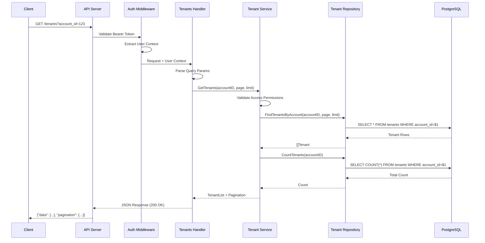
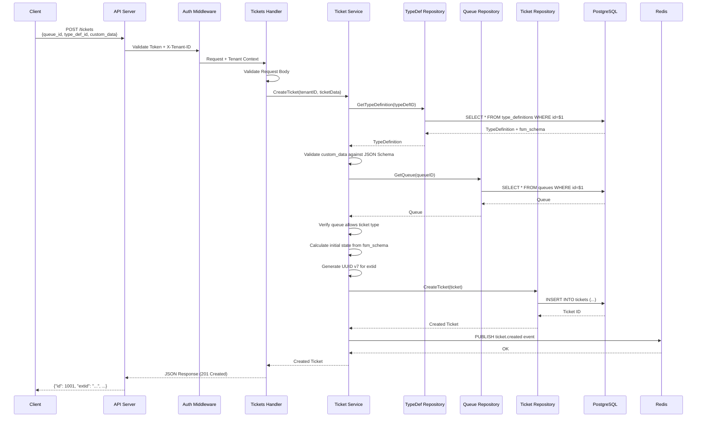
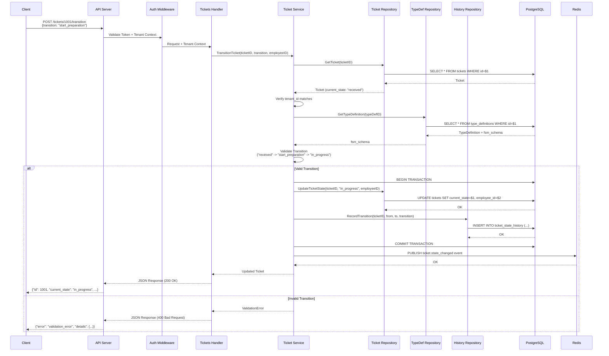

# Request Flow Sequence Diagrams

This document contains Mermaid sequence diagrams showing how requests flow through the VirtualQ API for key use cases.

## Use Case 1: GET /tenants - List All Tenants

## Use Case 2: POST /tickets - Create New Ticket

## Use Case 3: POST /tickets/{id}/transition - State Transition

## Key Patterns Illustrated

### Multi-Tenant Context Flow
All diagrams show how tenant_id flows through:
1. Extracted from X-Tenant-ID header in middleware
2. Passed explicitly to service layer
3. Used in repository for SQL WHERE clauses
4. Logged at every layer for observability

### Error Handling
The state transition diagram shows both success and error paths, demonstrating:
- Validation before database operations
- Transaction management for consistency
- Proper error responses with details

### Event Publishing
Both create and transition flows show Redis pub/sub for real-time updates to:
- Wall monitors
- Mobile apps
- Other services

### Defense in Depth
Multiple validation points:
- Middleware: Authentication and tenant access
- Handler: Request validation
- Service: Business logic validation (tenant ownership, FSM transitions)
- Repository: SQL-level tenant isolation
