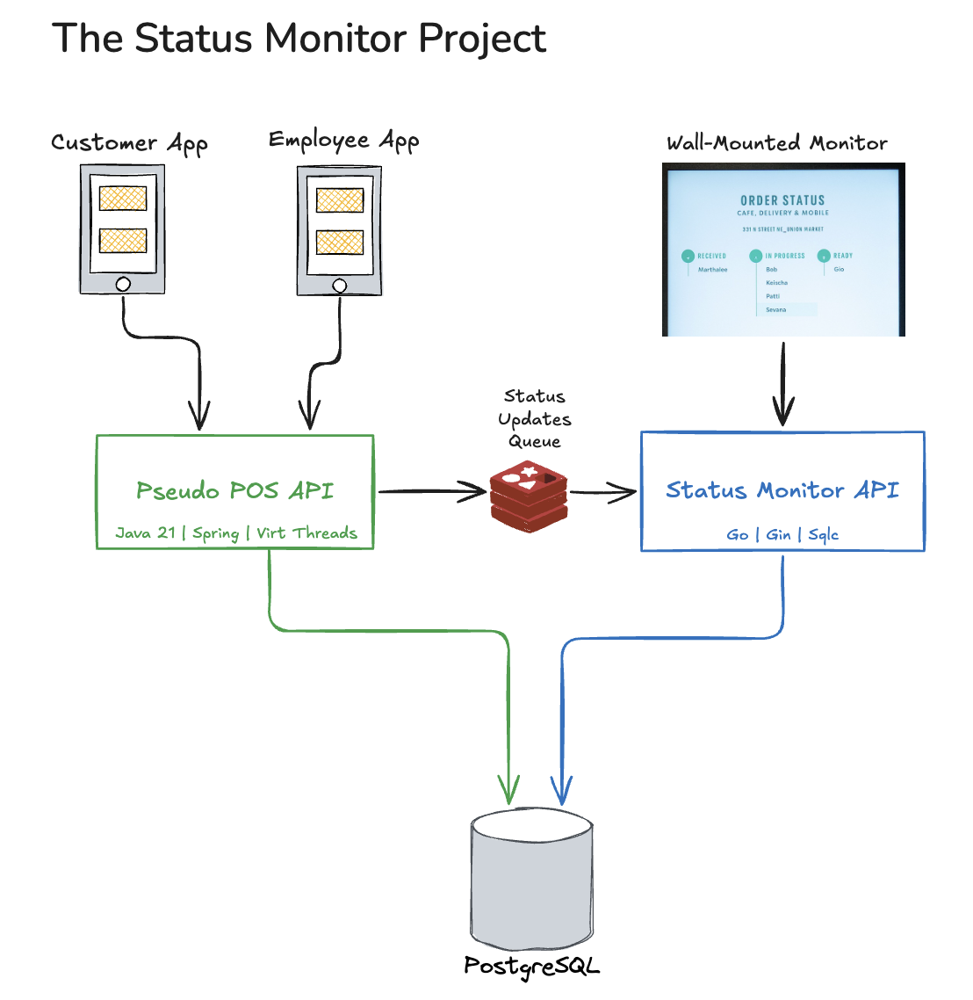

# VirtualQ Solution Architecture

This document defines the complete system architecture, component boundaries, and implementation strategy for the VirtualQ virtual queue management system.

## System Architecture Overview

The VirtualQ solution is based on the highly successful Starbucks Order Status monitor pattern, adapted for multi-tenant use across various industries (coffee shops, DMV offices, service centers, etc.).

## Solution Topology

The solution uses a distributed microservices architecture with the following components:

| Component | Technology Stack | Description |
|----|-------|-------------|
| **Customer App** | React Native | Customer-facing mobile app for queue management |
| **Employee App** | React Native | Employee-facing app for ticket fulfillment |
| **Wall Monitor** | React | Large wall-mounted status display |
| **POS API** | Java 21, Spring Boot 3.5.7, Maven | Core queue management and ticket processing |
| **Status Monitor API** | Go, Gin, sqlc | Real-time status updates and monitor backend |
| **Database** | PostgreSQL 17+ (Neon-hosted) | Multi-tenant data storage |
| **Event Queue** | Redis | Real-time updates and caching |

## Component Responsibilities

### POS API (Java/Spring Boot)
**Primary Service**: Core ticket and queue management
- Ticket lifecycle management (create, update, state transitions)
- Multi-tenant data isolation
- TypeDefinition and state machine validation
- Employee assignment and queue operations
- Integration with external POS systems

### Status Monitor API (Go/Gin)
**Primary Service**: Real-time status broadcasting
- Monitor display data aggregation
- Real-time event streaming
- Performance-optimized queue queries
- WebSocket connections for live updates

### Customer App (React Native)
**Primary Service**: Customer queue interaction
- Queue joining and ticket creation
- Real-time status tracking
- Push notifications for status changes
- Menu browsing and order placement

### Employee App (React Native)
**Primary Service**: Ticket fulfillment workflow
- Pending ticket management
- State transition controls (start, complete, etc.)
- Employee assignment and handoff
- Item-level progress tracking

### Wall Monitor (React)
**Primary Service**: Public status display
- Real-time queue visualization
- Customer name display (privacy-safe)
- Estimated wait times
- Multi-queue support for complex tenants

## Key Use Cases by Component

### Customer App Use Cases
- **Authentication**: Login and user session management
- **Menu Display**: Browse available items/services
- **Order Creation**: Add items and create tickets
- **Status Tracking**: Monitor ticket progress and position
- **Notifications**: Receive alerts for status changes

### Employee App Use Cases
- **Queue Management**: View and sort pending tickets
- **Ticket Processing**: Start, progress, and complete tickets
- **Item Fulfillment**: Track individual item completion
- **Assignment**: Take ownership of tickets
- **Escalation**: Handle issues and exceptions

### Wall Monitor Use Cases
- **Live Display**: Show current queue status
- **Multi-Queue**: Display multiple service lines
- **Customer Privacy**: Show names safely (John S.)
- **Wait Times**: Display estimated completion times

## Technology Stack Rationale

### Backend Services
- **POS API (Java/Spring Boot)**: Mature ecosystem, strong transaction support, enterprise-grade
- **Status Monitor (Go/Gin)**: High performance, excellent concurrency for real-time operations
- **Database (PostgreSQL)**: JSONB support for metadata-driven architecture, strong consistency
- **Cache/Queue (Redis)**: Fast pub/sub for real-time updates, session storage

### Frontend Applications
- **React Native**: Cross-platform mobile development, shared codebase
- **React**: Mature ecosystem for web displays, component reusability

### Infrastructure
- **UUID v7**: Time-sortable identifiers for distributed systems
- **Multi-tenant Schema**: Single database with tenant isolation
- **Event-Driven**: Redis pub/sub for real-time coordination

## Spec-Driven Development Strategy

### SDD Approach for VirtualQ
This project uses Spec-Driven Development (SDD) to manage complexity and provide rich context for AI-assisted development.

**Benefits**:
- **Deep Context**: Requirements and design documents provide comprehensive background
- **Focused Implementation**: Each spec targets a specific component or feature
- **AI Guidance**: Rich context enables better AI decision-making
- **Iterative Refinement**: Specs can be updated as understanding evolves

**Limitations**:
- **Scope Constraints**: SDD tools work best on focused, single-service implementations
- **Partitioning Required**: Complex multi-service projects need component-level specs
- **Tool Maturity**: Current SDD tools have memory and context limitations

### Implementation Strategy
1. **Component-Level Specs**: Create separate specs for each major component
2. **Shared Context**: Use steering files to maintain architectural consistency
3. **Incremental Development**: Build working features before comprehensive coverage
4. **Cross-Service Integration**: Define clear API contracts between components

## Development Constraints

### SDD Tool Limitations
- **Single Repository Focus**: Most SDD tools work best within one repo
- **Context Size**: Limited ability to handle entire system complexity
- **Component Boundaries**: Need clear separation for effective AI assistance

### Architectural Constraints
- **Multi-Tenant Isolation**: All components must respect tenant boundaries
- **Real-Time Requirements**: Sub-200ms response times for queue operations
- **State Consistency**: Distributed state machines require careful coordination
- **Scalability**: Design for multiple tenants with varying load patterns

## Integration Patterns

### API Communication
- **REST APIs**: Standard HTTP for CRUD operations
- **WebSockets**: Real-time updates for monitors and apps
- **Event Streaming**: Redis pub/sub for cross-service coordination

### Data Flow
1. **Customer Action** → Customer App → POS API → Database
2. **State Change** → POS API → Redis Event → Status Monitor API → Wall Monitor
3. **Employee Action** → Employee App → POS API → State Transition → Notifications

### Security Model
- **Multi-Tenant Isolation**: Tenant-scoped authentication and data access
- **API Authentication**: Bearer tokens and API keys
- **Data Validation**: JSON Schema validation for custom fields

## Next Steps

### Immediate Priorities
1. **Database Implementation**: Execute database design spec
2. **POS API Core**: Implement ticket management and state machines
3. **Basic Monitor**: Create simple status display
4. **Mobile MVP**: Basic customer and employee apps

### Future Enhancements
- Advanced analytics and reporting
- Integration with external POS systems
- Advanced notification systems
- Performance optimization and caching strategies