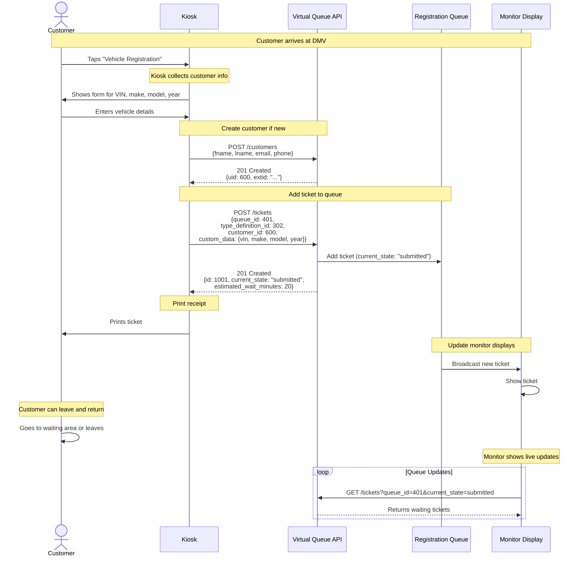
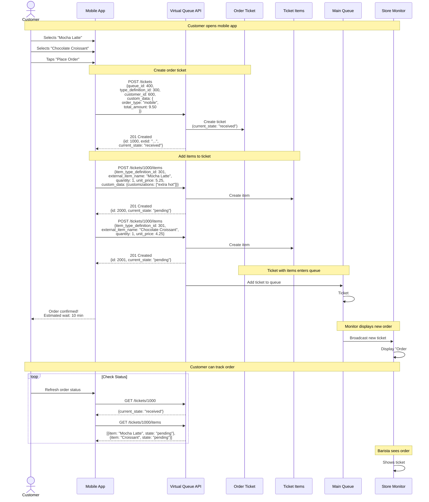
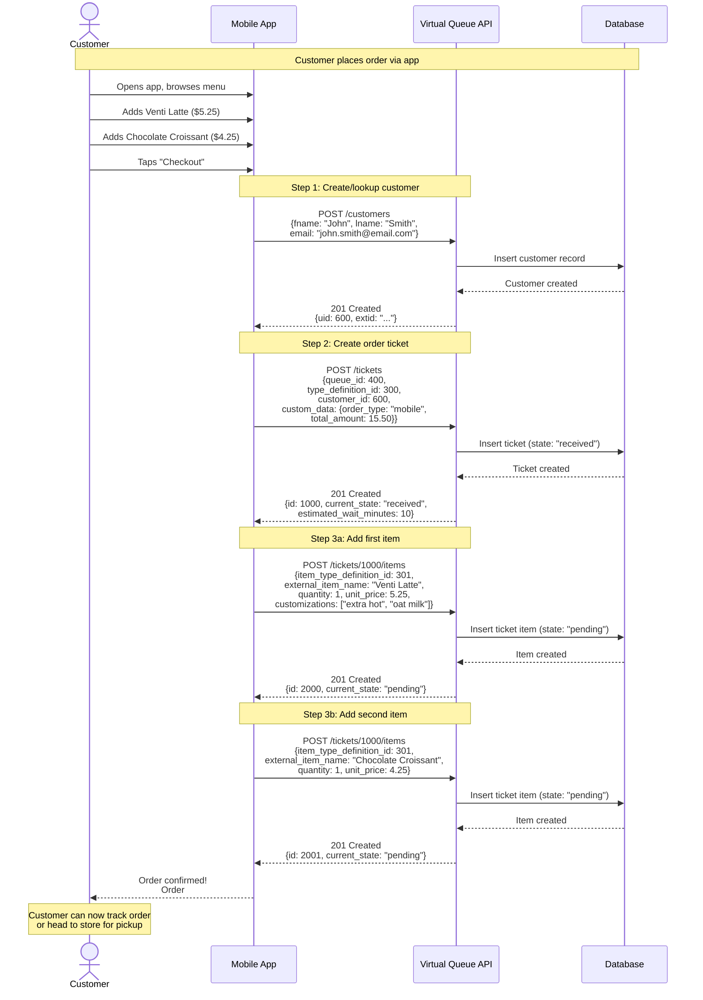
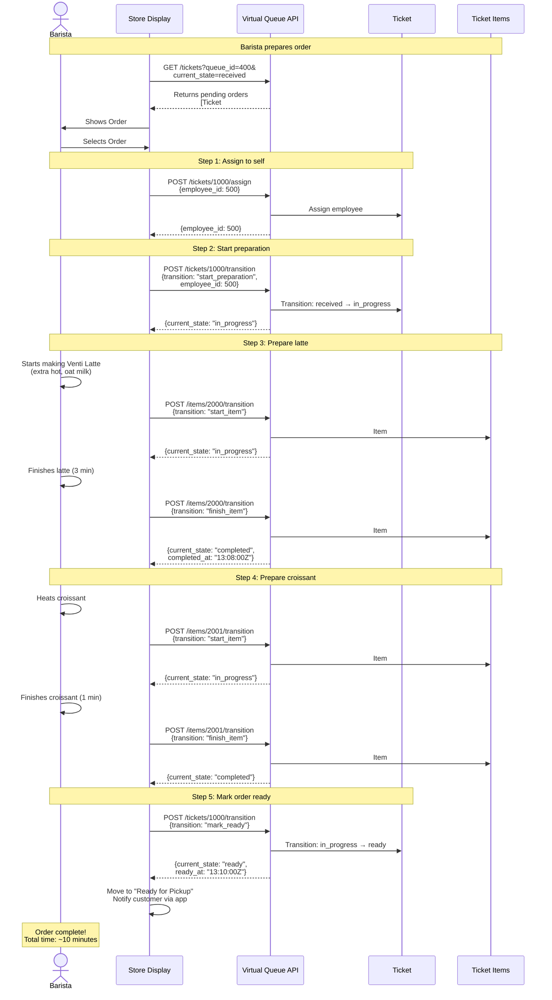
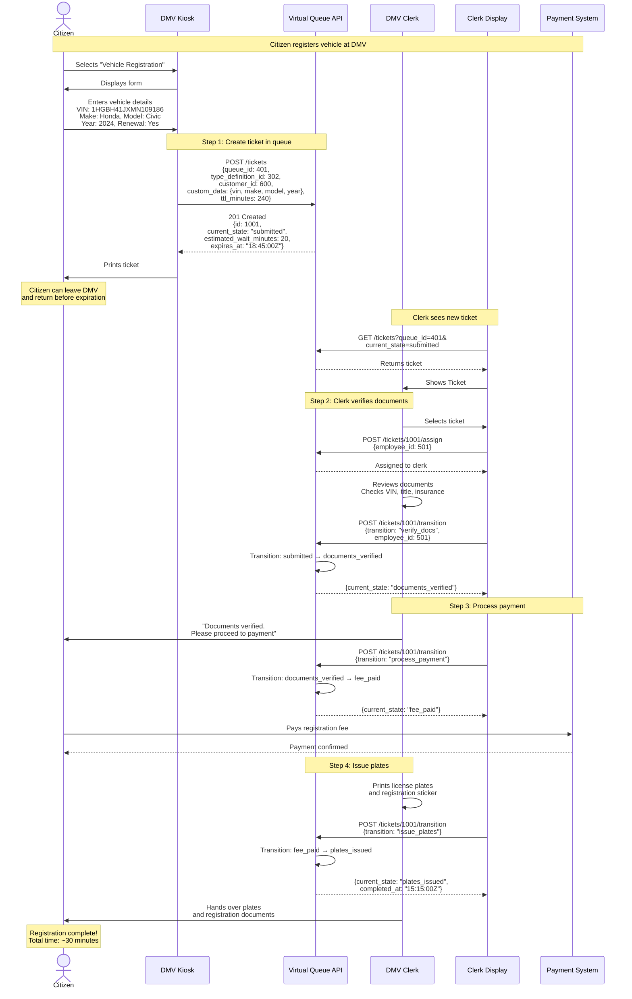
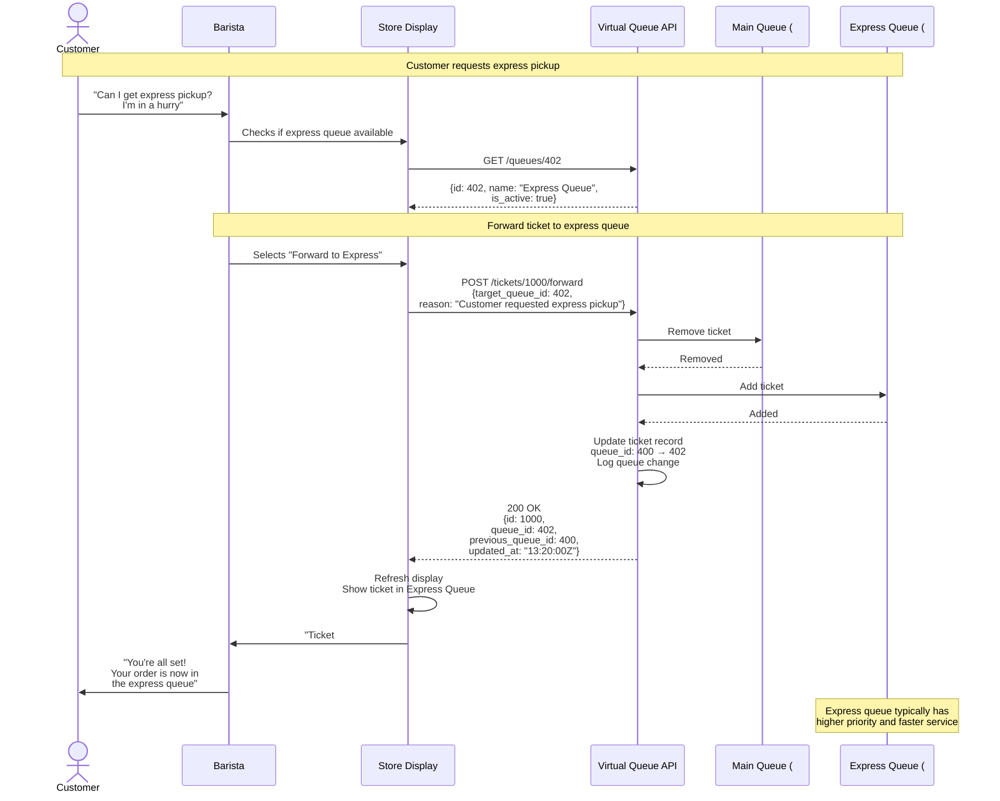

# Virtual Queue System - API Use Cases

This document demonstrates common real-world scenarios and workflows using the Virtual Queue REST API. Each use case shows the sequence of API calls needed to accomplish a specific task.

---

## Table of Contents

1. [Initial System Setup](#initial-system-setup)
2. [Queue Workflow Diagrams](#queue-workflow-diagrams)
3. [Coffee Shop Use Cases](#coffee-shop-use-cases)
4. [DMV Office Use Cases](#dmv-office-use-cases)
5. [Common Workflow Patterns](#common-workflow-patterns)

---

## Initial System Setup

### Use Case 1.1: Create a New Coffee Chain Account

**Scenario**: Set up a new coffee chain account with multiple store locations.

**Steps**:

#### Step 1: Create Account
```http
POST /accounts
Authorization: Bearer ADMIN_TOKEN
Content-Type: application/json

{
  "name": "Coffee Chain Corp",
  "billing_email": "billing@coffeechain.com",
  "billing_address": "123 Corporate Way, Seattle, WA 98101"
}
```

**Response**:
```json
{
  "id": 100,
  "extid": "550e8400-e29b-41d4-a716-446655440000",
  "name": "Coffee Chain Corp",
  "is_active": true,
  "created_at": "2025-01-15T10:00:00Z"
}
```

#### Step 2: Create First Tenant (Downtown Store)
```http
POST /tenants
Authorization: Bearer ACCOUNT_TOKEN

{
  "account_id": 100,
  "name": "Downtown Seattle Coffee",
  "location_name": "Downtown Seattle Store",
  "location_address": "123 Pike St, Seattle, WA 98101",
  "location_coordinates": {
    "latitude": 47.6062,
    "longitude": -122.3321
  },
  "config": {
    "theme": "coffee-light",
    "show_wait_times": true
  }
}
```

**Response**:
```json
{
  "id": 200,
  "extid": "650e8400-e29b-41d4-a716-446655440001",
  "account_id": 100,
  "name": "Downtown Seattle Coffee",
  "is_active": true,
  "created_at": "2025-01-15T10:30:00Z"
}
```

#### Step 3: Create Ticket Type Definitions

**3a. Create Food Order Type**:
```http
POST /type-definitions
X-Tenant-ID: 200

{
  "tenant_id": 200,
  "type_code": "food_order",
  "type_name": "Food Order",
  "description": "Customer food and beverage order",
  "custom_fields_schema": {
    "type": "object",
    "properties": {
      "order_type": {
        "type": "string",
        "enum": ["mobile", "in-store", "drive-thru"]
      },
      "total_amount": {"type": "number"}
    },
    "required": ["order_type"]
  },
  "fsm_schema": {
    "init": "received",
    "states": ["received", "in_progress", "ready", "picked_up", "cancelled"],
    "transitions": [
      {"name": "start_preparation", "from": "received", "to": "in_progress"},
      {"name": "mark_ready", "from": "in_progress", "to": "ready"},
      {"name": "pickup", "from": "ready", "to": "picked_up"},
      {"name": "cancel_new", "from": "received", "to": "cancelled"}
    ]
  },
  "item_definition_ids": [301]
}
```

**Response**:
```json
{
  "id": 300,
  "extid": "750e8400-e29b-41d4-a716-446655440002",
  "type_code": "food_order",
  "type_name": "Food Order",
  "created_at": "2025-01-15T11:00:00Z"
}
```

**3b. Create Food Item Type**:
```http
POST /type-definitions
X-Tenant-ID: 200

{
  "tenant_id": 200,
  "type_code": "food_item",
  "type_name": "Food/Beverage Item",
  "description": "Individual food or beverage item",
  "custom_fields_schema": {
    "type": "object",
    "properties": {
      "customizations": {
        "type": "array",
        "items": {"type": "string"}
      }
    }
  },
  "fsm_schema": {
    "init": "pending",
    "states": ["pending", "in_progress", "completed", "needs_rework"],
    "transitions": [
      {"name": "start_item", "from": "pending", "to": "in_progress"},
      {"name": "finish_item", "from": "in_progress", "to": "completed"},
      {"name": "report_issue", "from": "completed", "to": "needs_rework"},
      {"name": "restart_item", "from": "needs_rework", "to": "in_progress"}
    ]
  }
}
```

**Response**:
```json
{
  "id": 301,
  "extid": "850e8400-e29b-41d4-a716-446655440003",
  "type_code": "food_item",
  "type_name": "Food/Beverage Item",
  "created_at": "2025-01-15T11:15:00Z"
}
```

#### Step 4: Create Main Queue
```http
POST /queues
X-Tenant-ID: 200

{
  "tenant_id": 200,
  "name": "Main Queue",
  "description": "Main ordering queue for mobile and in-store",
  "allowed_type_definition_ids": [300],
  "wait_estimation_method": "average_recent_3",
  "show_wait_time": true,
  "max_wait_minutes": 60,
  "display_order": 1
}
```

**Response**:
```json
{
  "id": 400,
  "extid": "950e8400-e29b-41d4-a716-446655440004",
  "name": "Main Queue",
  "is_active": true,
  "created_at": "2025-01-15T11:30:00Z"
}
```

#### Step 5: Create Employees
```http
POST /employees
X-Tenant-ID: 200

{
  "tenant_id": 200,
  "fname": "Sarah",
  "lname": "Johnson",
  "email": "sarah.j@coffee-seattle.com",
  "role": "barista"
}
```

**Response**:
```json
{
  "id": 500,
  "extid": "a50e8400-e29b-41d4-a716-446655440005",
  "fname": "Sarah",
  "lname": "Johnson",
  "role": "barista",
  "created_at": "2025-01-15T12:00:00Z"
}
```

---

## Queue Workflow Diagrams

These sequence diagrams illustrate common queue workflows showing the interaction between customers, systems, and the Virtual Queue API.

### Workflow 2.1: DMV Customer Self-Registration via Kiosk

**Scenario**: A customer arrives at the DMV and uses a kiosk to register themselves in the vehicle registration queue.



**Key API Calls**:
1. `POST /customers` - Register or look up customer
2. `POST /tickets` - Add customer to queue with registration details
3. `GET /tickets?queue_id=401&current_state=submitted` - Monitor queries for display updates

---

### Workflow 2.2: Starbucks Mobile Order with Items

**Scenario**: A customer orders a mocha latte and a croissant through the mobile app. The order (ticket) contains individual food items, and the ticket is placed in the queue.



**Key API Calls**:
1. `POST /tickets` - Creates the order ticket in the queue
2. `POST /tickets/{id}/items` - Adds each menu item to the ticket (called twice)
3. `GET /tickets/{id}` - Customer checks order status
4. `GET /tickets/{id}/items` - Customer checks individual item status

**Ticket-Item Relationship**:
- **Ticket** (Order #1000): Represents the customer's order in the queue
  - `queue_id`: 400 (Main Queue)
  - `current_state`: "received" → "in_progress" → "ready" → "picked_up"
  - Contains 2 items

- **TicketItem** (Item #2000 - Mocha Latte): Individual beverage
  - `ticket_id`: 1000 (belongs to Order #1000)
  - `current_state`: "pending" → "in_progress" → "completed"
  - Has its own state machine, independent of the order

- **TicketItem** (Item #2001 - Croissant): Individual food item
  - `ticket_id`: 1000 (belongs to Order #1000)
  - `current_state`: "pending" → "in_progress" → "completed"
  - Can be completed independently from the latte

---

## Coffee Shop Use Cases

### Use Case 2.1: Customer Places Mobile Order

**Scenario**: Customer places a mobile order for pickup.

#### Step 1: Create Customer (if new)
```http
POST /customers

{
  "fname": "John",
  "lname": "Smith",
  "email": "john.smith@email.com",
  "phone": "555-0101"
}
```

**Response**:
```json
{
  "uid": 600,
  "extid": "b50e8400-e29b-41d4-a716-446655440006",
  "fname": "John",
  "lname": "Smith",
  "created_at": "2025-01-15T13:00:00Z"
}
```

#### Step 2: Create Ticket (Order)
```http
POST /tickets
X-Tenant-ID: 200

{
  "queue_id": 400,
  "type_definition_id": 300,
  "customer_id": 600,
  "custom_data": {
    "order_type": "mobile",
    "total_amount": 15.50,
    "special_instructions": "Extra hot"
  },
  "estimated_wait_minutes": 10
}
```

**Response**:
```json
{
  "id": 1000,
  "extid": "c50e8400-e29b-41d4-a716-446655440007",
  "queue_id": 400,
  "type_definition_id": 300,
  "current_state": "received",
  "customer_id": 600,
  "estimated_wait_minutes": 10,
  "created_at": "2025-01-15T13:00:00Z"
}
```

#### Step 3: Add Items to Order
```http
POST /tickets/1000/items
X-Tenant-ID: 200

{
  "item_type_definition_id": 301,
  "external_item_id": "menu-latte-venti",
  "external_item_name": "Venti Latte",
  "quantity": 1,
  "unit_price": 5.25,
  "custom_data": {
    "customizations": ["extra hot", "oat milk"]
  }
}
```

**Response**:
```json
{
  "id": 2000,
  "extid": "d50e8400-e29b-41d4-a716-446655440008",
  "ticket_id": 1000,
  "current_state": "pending",
  "external_item_name": "Venti Latte",
  "quantity": 1,
  "unit_price": 5.25,
  "created_at": "2025-01-15T13:00:00Z"
}
```

```http
POST /tickets/1000/items
X-Tenant-ID: 200

{
  "item_type_definition_id": 301,
  "external_item_id": "menu-croissant-chocolate",
  "external_item_name": "Chocolate Croissant",
  "quantity": 1,
  "unit_price": 4.25,
  "custom_data": {}
}
```

**Response**:
```json
{
  "id": 2001,
  "extid": "e50e8400-e29b-41d4-a716-446655440009",
  "ticket_id": 1000,
  "current_state": "pending",
  "external_item_name": "Chocolate Croissant",
  "created_at": "2025-01-15T13:00:30Z"
}
```

#### Sequence Diagram: Customer Places Mobile Order



---

### Use Case 2.2: Barista Fulfills Order

**Scenario**: Barista pulls the order and prepares items.

#### Step 1: Get Pending Orders
```http
GET /tickets?queue_id=400&current_state=received&limit=10
X-Tenant-ID: 200
```

**Response**:
```json
{
  "tickets": [
    {
      "id": 1000,
      "extid": "c50e8400-e29b-41d4-a716-446655440007",
      "current_state": "received",
      "customer_id": 600,
      "custom_data": {
        "order_type": "mobile",
        "total_amount": 15.50
      },
      "created_at": "2025-01-15T13:00:00Z"
    }
  ],
  "total": 1
}
```

#### Step 2: Assign Order to Barista
```http
POST /tickets/1000/assign
X-Tenant-ID: 200

{
  "employee_id": 500
}
```

**Response**:
```json
{
  "id": 1000,
  "employee_id": 500,
  "updated_at": "2025-01-15T13:05:00Z"
}
```

#### Step 3: Start Preparation
```http
POST /tickets/1000/transition
X-Tenant-ID: 200

{
  "transition": "start_preparation",
  "employee_id": 500
}
```

**Response**:
```json
{
  "id": 1000,
  "current_state": "in_progress",
  "previous_state": "received",
  "employee_id": 500,
  "started_at": "2025-01-15T13:05:30Z"
}
```

#### Step 4: Start First Item
```http
POST /items/2000/transition
X-Tenant-ID: 200

{
  "transition": "start_item"
}
```

**Response**:
```json
{
  "id": 2000,
  "current_state": "in_progress",
  "previous_state": "pending",
  "started_at": "2025-01-15T13:05:45Z"
}
```

#### Step 5: Complete First Item
```http
POST /items/2000/transition
X-Tenant-ID: 200

{
  "transition": "finish_item"
}
```

**Response**:
```json
{
  "id": 2000,
  "current_state": "completed",
  "previous_state": "in_progress",
  "completed_at": "2025-01-15T13:08:00Z"
}
```

#### Step 6: Complete Second Item
```http
POST /items/2001/transition
X-Tenant-ID: 200

{
  "transition": "start_item"
}
```

```http
POST /items/2001/transition
X-Tenant-ID: 200

{
  "transition": "finish_item"
}
```

#### Step 7: Mark Order Ready
```http
POST /tickets/1000/transition
X-Tenant-ID: 200

{
  "transition": "mark_ready"
}
```

**Response**:
```json
{
  "id": 1000,
  "current_state": "ready",
  "previous_state": "in_progress",
  "ready_at": "2025-01-15T13:10:00Z"
}
```

#### Sequence Diagram: Barista Fulfills Order



---

### Use Case 2.3: Customer Picks Up Order

**Scenario**: Customer arrives and picks up their completed order.

#### Step 1: Mark Order as Picked Up
```http
POST /tickets/1000/transition
X-Tenant-ID: 200

{
  "transition": "pickup"
}
```

**Response**:
```json
{
  "id": 1000,
  "current_state": "picked_up",
  "previous_state": "ready",
  "picked_up_at": "2025-01-15T13:15:00Z",
  "completed_at": "2025-01-15T13:15:00Z"
}
```

### Use Case 2.4: Handle Item Issue (Remake)

**Scenario**: Customer reports issue with item, barista needs to remake it.

#### Step 1: Report Issue
```http
POST /items/2000/transition
X-Tenant-ID: 200

{
  "transition": "report_issue"
}
```

**Response**:
```json
{
  "id": 2000,
  "current_state": "needs_rework",
  "previous_state": "completed"
}
```

#### Step 2: Restart Item
```http
POST /items/2000/transition
X-Tenant-ID: 200

{
  "transition": "restart_item"
}
```

**Response**:
```json
{
  "id": 2000,
  "current_state": "in_progress",
  "previous_state": "needs_rework",
  "started_at": "2025-01-15T13:20:00Z"
}
```

#### Step 3: Complete Remade Item
```http
POST /items/2000/transition
X-Tenant-ID: 200

{
  "transition": "finish_item"
}
```

---

## DMV Office Use Cases

### Use Case 3.1: Setup DMV Office

**Scenario**: Set up a DMV office with multiple service queues.

#### Step 1: Create DMV Tenant
```http
POST /tenants

{
  "account_id": 100,
  "name": "Seattle DMV",
  "location_name": "Seattle DMV Office",
  "location_address": "789 5th Ave, Seattle, WA 98104"
}
```

**Response**:
```json
{
  "id": 201,
  "extid": "f50e8400-e29b-41d4-a716-446655440010",
  "name": "Seattle DMV",
  "created_at": "2025-01-15T14:00:00Z"
}
```

#### Step 2: Create Vehicle Registration Type Definition
```http
POST /type-definitions
X-Tenant-ID: 201

{
  "tenant_id": 201,
  "type_code": "dmv_registration",
  "type_name": "Vehicle Registration",
  "description": "Vehicle registration and renewal",
  "custom_fields_schema": {
    "type": "object",
    "properties": {
      "vin": {"type": "string", "maxLength": 17},
      "make": {"type": "string"},
      "model": {"type": "string"},
      "year": {"type": "integer"},
      "renewal": {"type": "boolean"}
    },
    "required": ["vin", "make", "model", "year"]
  },
  "fsm_schema": {
    "init": "submitted",
    "states": ["submitted", "documents_verified", "fee_paid", "plates_issued", "error", "cancelled"],
    "transitions": [
      {"name": "verify_docs", "from": "submitted", "to": "documents_verified"},
      {"name": "validation_error", "from": "submitted", "to": "error"},
      {"name": "process_payment", "from": "documents_verified", "to": "fee_paid"},
      {"name": "issue_plates", "from": "fee_paid", "to": "plates_issued"},
      {"name": "resubmit", "from": "error", "to": "submitted"}
    ]
  }
}
```

**Response**:
```json
{
  "id": 302,
  "extid": "g50e8400-e29b-41d4-a716-446655440011",
  "type_code": "dmv_registration",
  "created_at": "2025-01-15T14:15:00Z"
}
```

#### Step 3: Create Registration Queue
```http
POST /queues
X-Tenant-ID: 201

{
  "tenant_id": 201,
  "name": "Registration Services",
  "description": "Vehicle registration and renewals",
  "allowed_type_definition_ids": [302],
  "wait_estimation_method": "rolling_average",
  "show_wait_time": true,
  "max_wait_minutes": 120,
  "display_order": 1
}
```

**Response**:
```json
{
  "id": 401,
  "extid": "h50e8400-e29b-41d4-a716-446655440012",
  "name": "Registration Services",
  "created_at": "2025-01-15T14:30:00Z"
}
```

### Use Case 3.2: Citizen Vehicle Registration

**Scenario**: Citizen submits vehicle registration application.

#### Step 1: Create Registration Ticket
```http
POST /tickets
X-Tenant-ID: 201

{
  "queue_id": 401,
  "type_definition_id": 302,
  "customer_id": 600,
  "custom_data": {
    "vin": "1HGBH41JXMN109186",
    "make": "Honda",
    "model": "Civic",
    "year": 2024,
    "renewal": true
  },
  "ttl_minutes": 240,
  "estimated_wait_minutes": 20
}
```

**Response**:
```json
{
  "id": 1001,
  "extid": "i50e8400-e29b-41d4-a716-446655440013",
  "queue_id": 401,
  "current_state": "submitted",
  "ttl_minutes": 240,
  "expires_at": "2025-01-15T18:45:00Z",
  "created_at": "2025-01-15T14:45:00Z"
}
```

#### Step 2: Clerk Verifies Documents
```http
POST /tickets/1001/assign
X-Tenant-ID: 201

{
  "employee_id": 501
}
```

```http
POST /tickets/1001/transition
X-Tenant-ID: 201

{
  "transition": "verify_docs",
  "employee_id": 501
}
```

**Response**:
```json
{
  "id": 1001,
  "current_state": "documents_verified",
  "previous_state": "submitted",
  "employee_id": 501
}
```

#### Step 3: Process Payment
```http
POST /tickets/1001/transition
X-Tenant-ID: 201

{
  "transition": "process_payment"
}
```

**Response**:
```json
{
  "id": 1001,
  "current_state": "fee_paid",
  "previous_state": "documents_verified"
}
```

#### Step 4: Issue Plates
```http
POST /tickets/1001/transition
X-Tenant-ID: 201

{
  "transition": "issue_plates"
}
```

**Response**:
```json
{
  "id": 1001,
  "current_state": "plates_issued",
  "previous_state": "fee_paid",
  "completed_at": "2025-01-15T15:15:00Z"
}
```

#### Sequence Diagram: DMV Citizen Vehicle Registration



---

### Use Case 3.3: Handle Validation Error

**Scenario**: Application fails validation, citizen needs to resubmit.

#### Step 1: Validation Error
```http
POST /tickets/1002/transition
X-Tenant-ID: 201

{
  "transition": "validation_error",
  "notes": "Missing proof of insurance"
}
```

**Response**:
```json
{
  "id": 1002,
  "current_state": "error",
  "previous_state": "submitted"
}
```

#### Step 2: Citizen Resubmits
```http
PUT /tickets/1002
X-Tenant-ID: 201

{
  "custom_data": {
    "vin": "1HGBH41JXMN109186",
    "make": "Honda",
    "model": "Civic",
    "year": 2024,
    "renewal": true,
    "insurance_policy": "INS-123456"
  }
}
```

```http
POST /tickets/1002/transition
X-Tenant-ID: 201

{
  "transition": "resubmit"
}
```

**Response**:
```json
{
  "id": 1002,
  "current_state": "submitted",
  "previous_state": "error"
}
```

---

## Common Workflow Patterns

### Pattern 4.1: Check Queue Status

**Scenario**: Get real-time queue statistics.

```http
POST /tickets/count
X-Tenant-ID: 200

{
  "queue_id": 400,
  "current_state": "received"
}
```

**Response**:
```json
{
  "count": 5
}
```

```http
POST /tickets/count
X-Tenant-ID: 200

{
  "queue_id": 400,
  "current_state": "in_progress"
}
```

**Response**:
```json
{
  "count": 3
}
```

### Pattern 4.2: Get Employee's Active Tickets

**Scenario**: Barista wants to see all tickets assigned to them.

```http
GET /employees/500/tickets?current_state=in_progress
X-Tenant-ID: 200
```

**Response**:
```json
{
  "tickets": [
    {
      "id": 1000,
      "current_state": "in_progress",
      "customer_id": 600,
      "created_at": "2025-01-15T13:00:00Z",
      "started_at": "2025-01-15T13:05:30Z"
    }
  ]
}
```

### Pattern 4.3: Forward Ticket to Another Queue

**Scenario**: Transfer ticket from main queue to express queue.

```http
POST /tickets/1000/forward
X-Tenant-ID: 200

{
  "target_queue_id": 402,
  "reason": "Customer requested express pickup"
}
```

**Response**:
```json
{
  "id": 1000,
  "queue_id": 402,
  "previous_queue_id": 400,
  "updated_at": "2025-01-15T13:20:00Z"
}
```

#### Sequence Diagram: Forward Ticket to Another Queue



---

### Pattern 4.4: View Ticket History

**Scenario**: Get complete state transition history for a ticket.

```http
GET /tickets/1000/history
X-Tenant-ID: 200
```

**Response**:
```json
{
  "history": [
    {
      "id": 1,
      "previous_state": null,
      "new_state": "received",
      "changed_by_employee_id": null,
      "created_at": "2025-01-15T13:00:00Z"
    },
    {
      "id": 2,
      "previous_state": "received",
      "new_state": "in_progress",
      "changed_by_employee_id": 500,
      "created_at": "2025-01-15T13:05:30Z"
    },
    {
      "id": 3,
      "previous_state": "in_progress",
      "new_state": "ready",
      "changed_by_employee_id": 500,
      "created_at": "2025-01-15T13:10:00Z"
    },
    {
      "id": 4,
      "previous_state": "ready",
      "new_state": "picked_up",
      "changed_by_employee_id": null,
      "created_at": "2025-01-15T13:15:00Z"
    }
  ]
}
```

### Pattern 4.5: Search Tickets with Complex Filters

**Scenario**: Find all mobile orders created today that are ready for pickup.

```http
GET /tickets?queue_id=400&current_state=ready&created_after=2025-01-15T00:00:00Z&limit=20
X-Tenant-ID: 200
```

**Response**:
```json
{
  "tickets": [
    {
      "id": 1003,
      "current_state": "ready",
      "custom_data": {
        "order_type": "mobile",
        "total_amount": 12.50
      },
      "created_at": "2025-01-15T13:30:00Z",
      "ready_at": "2025-01-15T13:45:00Z"
    },
    {
      "id": 1005,
      "current_state": "ready",
      "custom_data": {
        "order_type": "mobile",
        "total_amount": 8.75
      },
      "created_at": "2025-01-15T14:00:00Z",
      "ready_at": "2025-01-15T14:12:00Z"
    }
  ],
  "total": 2,
  "page": 1,
  "limit": 20
}
```

### Pattern 4.6: Reorder Ticket Position

**Scenario**: Move urgent ticket to front of queue.

```http
POST /tickets/1004/reorder
X-Tenant-ID: 200

{
  "position": 1,
  "reason": "Customer is pregnant and needs priority"
}
```

**Response**:
```json
{
  "id": 1004,
  "queue_position": 1,
  "previous_position": 8,
  "updated_at": "2025-01-15T14:30:00Z"
}
```

### Pattern 4.7: Cancel Ticket

**Scenario**: Customer cancels their order.

```http
DELETE /tickets/1005
X-Tenant-ID: 200
```

**Response**:
```json
{
  "id": 1005,
  "current_state": "cancelled",
  "previous_state": "received",
  "updated_at": "2025-01-15T14:45:00Z"
}
```

Or using state transition:
```http
POST /tickets/1005/transition
X-Tenant-ID: 200

{
  "transition": "cancel_new",
  "notes": "Customer requested cancellation"
}
```

### Pattern 4.8: Disable Queue Temporarily

**Scenario**: Close a queue during lunch break.

```http
POST /queues/400/disable
X-Tenant-ID: 200
```

**Response**:
```json
{
  "id": 400,
  "name": "Main Queue",
  "is_active": false,
  "updated_at": "2025-01-15T12:00:00Z"
}
```

**Enable it again**:
```http
POST /queues/400/enable
X-Tenant-ID: 200
```

**Response**:
```json
{
  "id": 400,
  "name": "Main Queue",
  "is_active": true,
  "updated_at": "2025-01-15T13:00:00Z"
}
```

---

## Best Practices

### 1. Always Use External IDs (extid)
When storing references to resources in your application, use the `extid` field instead of the internal `id` field for API stability.

### 2. Handle State Transition Errors
Always validate state transitions against the FSM schema before calling the transition endpoint:

```http
GET /type-definitions/300
```

Check the `fsm_schema.transitions` to ensure the requested transition is valid.

### 3. Use Tenant Context Headers
For multi-tenant applications, always include `X-Tenant-ID` header to scope operations:

```http
X-Tenant-ID: 200
```

### 4. Implement Pagination
For list endpoints, always use pagination to avoid large response payloads:

```http
GET /tickets?page=1&limit=20
```

### 5. Monitor TTL Expiration
For workflows with TTL (like DMV applications), monitor the `expires_at` field and handle expiring tickets appropriately:

```http
GET /tickets?expires_at_before=2025-01-15T15:00:00Z&queue_id=401
```

### 6. Use Webhooks for Real-Time Updates
Subscribe to webhooks instead of polling for ticket state changes:

```json
{
  "event": "ticket.state_changed",
  "data": {
    "ticket_id": 1000,
    "previous_state": "received",
    "new_state": "in_progress"
  }
}
```

---

## See Also

- [REST API Reference](rest-api.md) - Complete endpoint documentation
- [Database Design](database-design.md) - Schema and data model documentation
- [Starbucks Example Data](../schema/starbucks-example-data.sql) - Sample SQL data
- [DMV Example Data](../schema/dmv-example-data.sql) - Sample SQL data
