# Virtual Queue System - Database Design Documentation

## Overview

The Virtual Queue System is a multi-tenant SaaS solution for managing virtual queues across various industries. The database schema supports flexible, metadata-driven ticket workflows that can handle everything from Starbucks-style order tracking to DMV service queues.

**Key Features:**
- **Multi-tenancy**: Account → Tenant hierarchy for SaaS deployment
- **Metadata-driven workflows**: Ticket types and state machines defined in JSONB
- **Flexible composition**: Tickets can contain items with their own state machines
- **Workflow chaining**: Tickets can reference other tickets (e.g., delivery → kitchen order)
- **Extensible custom data**: JSON Schema validation for tenant-specific fields

## Primary Use Cases

This system is designed to support two initial tenant types:

### 1. Starbucks-Style Coffee Shop
*See: [docs/design-notebook/tenenant-examples/starbucks-order-status-case-study.md](../.kiro/steering/domain/tenenant-examples/starbucks-order-status-case-study.md)*

- **Order tracking**: Mobile, in-store, and drive-thru orders
- **Item-level workflow**: Track individual drinks and food items
- **In-store monitors**: Real-time order status displays
- **State machine**: received → in_progress → ready → picked_up
- **Example data**: `/schema/starbucks-example-data.sql`

### 2. DMV Service Center
*See: [docs/design-notebook/tenenant-examples/DMV-virtual-lines.md](../.kiro/steering/domain/tenenant-examples/DMV-virtual-lines.md)*

- **Multiple service lines**: Registration, Licenses, Titles
- **Complex workflows**: Multi-step processes with testing and verification
- **Virtual waiting**: Citizens can leave and return when ready
- **TTL tracking**: Automatic escalation for long-wait tickets
- **Example data**: `/schema/dmv-example-data.sql`

---

## Database Architecture

### Entity-Relationship Diagram

The following diagram shows the complete database schema with all tables and their relationships:


### State Machine Model

The system uses **JSONB-based finite state machines** stored in `TypeDefinition.fsm_schema`. This approach provides:

- **Compact representation**: Entire state machine in one JSON field
- **Easy to understand**: Visual inspection of states and transitions
- **Versionable**: Track state machine changes over time
- **Transition validation**: Explicit allowed transitions between states

**FSM Schema Format** (based on [jakesgordon library](https://github.com/jakesgordon/javascript-state-machine)):

```json
{
  "init": "received",
  "states": ["received", "in_progress", "ready", "picked_up"],
  "transitions": [
    {"name": "start_preparation", "from": "received", "to": "in_progress"},
    {"name": "mark_ready", "from": "in_progress", "to": "ready"},
    {"name": "pickup", "from": "ready", "to": "picked_up"}
  ]
}
```

*See: [docs/design-notebook/database-state-machine.md](../.kiro/steering/technical/database-state-machine.md)*

**Future Optimization**: The JSONB state machines can later be denormalized into relational tables for query performance while keeping JSONB as the source of truth.

---

## Enum Types

### wait_estimation_method_enum

Methods for calculating estimated wait times in virtual queues.

| Value | Description |
|-------|-------------|
| `average_recent_3` | Average of last 3 completed tickets of same type |
| `average_recent_5` | Average of last 5 completed tickets of same type |
| `rolling_average` | Rolling average over time window |
| `manual` | Manually set by staff |
| `custom` | Custom function defined by tenant |
| `none` | No estimation shown to customers |

---

## Core Tables

### Account

Top-level billing and procurement entity. One account can have multiple tenants (e.g., a coffee chain with multiple store locations).

| Column | Type | Constraints | Description |
|--------|------|-------------|-------------|
| `id` | serial | PRIMARY KEY | Internal identifier |
| `extid` | UUID | UNIQUE, NOT NULL | External UUID for API use |
| `name` | varchar(100) | NOT NULL | Account name |
| `billing_email` | varchar(100) | | Contact email for billing |
| `billing_address` | text | | Billing address |
| `is_active` | boolean | DEFAULT true | Account active status |
| `created_at` | timestamptz | NOT NULL, DEFAULT now() | Creation timestamp |
| `updated_at` | timestamptz | | Last update timestamp (auto-updated) |

**Indexes**: `extid`, `is_active`

**Example**: "Coffee Chain Corp" with multiple store tenants

---

### Tenant

Unique product implementation for a customer. Contains configuration, settings, and customizations for a specific location or business unit.

| Column | Type | Constraints | Description |
|--------|------|-------------|-------------|
| `id` | serial | PRIMARY KEY | Internal identifier |
| `extid` | UUID | UNIQUE, NOT NULL | External UUID for API use |
| `account_id` | integer | NOT NULL, FOREIGN KEY → Account | Parent account |
| `name` | varchar(100) | NOT NULL | Tenant name |
| `description` | text | | Tenant description |
| `location_name` | varchar(200) | | Location name (e.g., "Downtown Seattle Store") |
| `location_address` | text | | Physical address |
| `location_coordinates` | point | | PostgreSQL point type for lat/lng |
| `config` | jsonb | | Tenant-level configuration (UI, branding, settings) |
| `ticket_schema` | jsonb | | Legacy JSON Schema field (deprecated) |
| `is_active` | boolean | DEFAULT true | Tenant active status |
| `created_at` | timestamptz | NOT NULL, DEFAULT now() | Creation timestamp |
| `updated_at` | timestamptz | | Last update timestamp (auto-updated) |

**Indexes**: `extid`, `account_id`, `is_active`

**Examples**:
- Starbucks: "Downtown Seattle Coffee" (tenant_id=1)
- DMV: "Seattle DMV Office" (tenant_id=1)

---

### Queue

Virtual queue within a tenant. Represents a "line" for getting goods or services.

| Column | Type | Constraints | Description |
|--------|------|-------------|-------------|
| `id` | serial | PRIMARY KEY | Internal identifier |
| `extid` | UUID | UNIQUE, NOT NULL | External UUID for API use |
| `tenant_id` | integer | NOT NULL, FOREIGN KEY → Tenant | Parent tenant |
| `name` | varchar(100) | NOT NULL | Queue name (e.g., "Main Queue", "Registration Services") |
| `description` | text | | Queue description |
| `allowed_type_definition_ids` | integer[] | | Array of allowed TypeDefinition IDs for this queue |
| `wait_estimation_method` | wait_estimation_method_enum | DEFAULT 'average_recent_3' | Wait time calculation method |
| `show_wait_time` | boolean | DEFAULT true | Whether to display wait times to customers |
| `max_wait_minutes` | integer | | Optional max wait time threshold for alerts |
| `is_active` | boolean | DEFAULT true | Queue active status |
| `display_order` | integer | | Sort order for UI display |
| `created_at` | timestamptz | NOT NULL, DEFAULT now() | Creation timestamp |
| `updated_at` | timestamptz | | Last update timestamp (auto-updated) |

**Indexes**: `extid`, `tenant_id`, `is_active`, `display_order`

**Examples**:
- Starbucks: Single "Main Queue" for mobile and in-store orders
- DMV: Multiple queues - "Registration Services", "License Services", "Title Services"

---

### TypeDefinition

Defines available ticket types (system-defined + tenant-specific). Each type has its own state machine, custom fields schema, and can optionally contain items.

| Column | Type | Constraints | Description |
|--------|------|-------------|-------------|
| `id` | serial | PRIMARY KEY | Internal identifier |
| `extid` | UUID | UNIQUE, NOT NULL | External UUID for API use |
| `tenant_id` | integer | FOREIGN KEY → Tenant | NULL for system-defined types, otherwise tenant-specific |
| `type_code` | varchar(32) | NOT NULL | Unique code (e.g., 'food_order', 'dmv_registration') |
| `type_name` | varchar(100) | NOT NULL | Display name (e.g., 'Food Order', 'Vehicle Registration') |
| `description` | varchar(255) | | Short description |
| `doc` | text | | Full documentation in markdown format |
| `custom_fields_schema` | jsonb | | JSON Schema defining structure of custom_data |
| `fsm_schema` | jsonb | | **Finite state machine definition** (states and transitions) |
| `item_definition_ids` | integer[] | | Array of TypeDefinition IDs that can be items within this type |
| `is_system_defined` | boolean | DEFAULT false | True for built-in types provided by system |
| `is_active` | boolean | DEFAULT true | Type active status |
| `created_at` | timestamptz | NOT NULL, DEFAULT now() | Creation timestamp |
| `updated_at` | timestamptz | | Last update timestamp (auto-updated) |

**Constraints**: `UNIQUE(tenant_id, type_code)` - Each tenant can only have one ticket type with a given code

**Indexes**: `extid`, `tenant_id`, `type_code`, `(tenant_id, type_code)`, `is_active`, `is_system_defined`, GIN index on `item_definition_ids`

**Key Field: fsm_schema**

The `fsm_schema` field stores the complete state machine as JSONB:

```json
{
  "init": "received",
  "states": ["received", "in_progress", "ready", "picked_up", "cancelled"],
  "transitions": [
    {"name": "start_preparation", "from": "received", "to": "in_progress"},
    {"name": "mark_ready", "from": "in_progress", "to": "ready"},
    {"name": "pickup", "from": "ready", "to": "picked_up"},
    {"name": "cancel", "from": "received", "to": "cancelled"}
  ]
}
```

**Examples**:
- Starbucks `food_order`: States for order workflow (received → in_progress → ready)
- Starbucks `food_item`: States for individual items (pending → in_progress → completed)
- DMV `dmv_registration`: Multi-step registration workflow
- DMV `dmv_license`: License application with testing steps

---

### Customer

Customers who create tickets in virtual queues.

| Column | Type | Constraints | Description |
|--------|------|-------------|-------------|
| `uid` | serial | PRIMARY KEY | Internal identifier |
| `extid` | UUID | UNIQUE, NOT NULL | External UUID for API use |
| `fname` | varchar(40) | | First name |
| `lname` | varchar(40) | | Last name |
| `email` | varchar(100) | | Email address |
| `phone` | varchar(20) | | Phone number |
| `is_active` | boolean | DEFAULT true | Customer active status |
| `created_at` | timestamptz | NOT NULL, DEFAULT now() | Creation timestamp |
| `updated_at` | timestamptz | | Last update timestamp (auto-updated) |

**Indexes**: `extid`, `email`

---

### Employee

Staff members who fulfill tickets. Scoped to a specific tenant.

| Column | Type | Constraints | Description |
|--------|------|-------------|-------------|
| `id` | serial | PRIMARY KEY | Internal identifier |
| `extid` | UUID | UNIQUE, NOT NULL | External UUID for API use |
| `tenant_id` | integer | NOT NULL, FOREIGN KEY → Tenant | Tenant this employee belongs to |
| `fname` | varchar(40) | NOT NULL | First name |
| `lname` | varchar(40) | NOT NULL | Last name |
| `email` | varchar(100) | UNIQUE | Email address |
| `role` | varchar(20) | | Role (e.g., 'barista', 'manager', 'clerk', 'examiner') |
| `is_active` | boolean | DEFAULT true | Employee active status |
| `created_at` | timestamptz | NOT NULL, DEFAULT now() | Creation timestamp |
| `updated_at` | timestamptz | | Last update timestamp (auto-updated) |

**Indexes**: `extid`, `tenant_id`, `is_active`, `(tenant_id, is_active)`

---

### Ticket

Generic virtual queue ticket. Type and state are metadata-driven via `TypeDefinition.fsm_schema`.

| Column | Type | Constraints | Description |
|--------|------|-------------|-------------|
| `id` | serial | PRIMARY KEY | Internal identifier |
| `extid` | UUID | UNIQUE, NOT NULL | External UUID for API use |
| `queue_id` | integer | NOT NULL, FOREIGN KEY → Queue | Which virtual queue this ticket is in |
| `type_definition_id` | integer | NOT NULL, FOREIGN KEY → TypeDefinition | Ticket type definition |
| `current_state` | varchar(32) | NOT NULL | **Current state value** (validated against fsm_schema) |
| `customer_id` | integer | FOREIGN KEY → Customer | Customer who created ticket (optional) |
| `references_ticket_id` | integer | FOREIGN KEY → Ticket | Links to another ticket in workflow chain |
| `employee_id` | integer | FOREIGN KEY → Employee | Who is fulfilling the ticket |
| **Wait Time Tracking** |
| `estimated_wait_minutes` | integer | | Estimated wait time when ticket created |
| `actual_wait_minutes` | integer | | Actual wait time (calculated when completed) |
| **TTL and Escalation** |
| `ttl_minutes` | integer | | Time-to-live before escalation/expiry |
| `escalated_at` | timestamptz | | When ticket was escalated |
| `expires_at` | timestamptz | | When ticket expires |
| **Customization** |
| `custom_data` | jsonb | | Validated against TypeDefinition.custom_fields_schema. Contains ticket-type-specific fields |
| **State Timestamps** |
| `started_at` | timestamptz | | When work started on ticket |
| `ready_at` | timestamptz | | When ticket marked ready/complete |
| `picked_up_at` | timestamptz | | When customer picked up |
| `completed_at` | timestamptz | | When ticket fully completed |
| `created_at` | timestamptz | NOT NULL, DEFAULT now() | Creation timestamp |
| `updated_at` | timestamptz | | Last update timestamp (auto-updated) |

**Indexes**: Extensive indexing including:
- Basic: `extid`, `queue_id`, `type_definition_id`, `current_state`, `customer_id`, `created_at`, `employee_id`, `references_ticket_id`
- Compound: `(queue_id, current_state)`, `(queue_id, current_state, created_at DESC)`, `(current_state, created_at DESC)`, `(type_definition_id, current_state)`
- Conditional: `(employee_id, current_state)`, `(expires_at)` WHERE expires_at IS NOT NULL
- GIN index on `custom_data` for JSONB queries

**Key Field: current_state**

The `current_state` field stores the current state value as a string. Transition validation is performed by checking against the `fsm_schema` transitions in the associated `TypeDefinition`.

**Key Field: custom_data**

Ticket-type-specific data stored as JSONB and validated against `TypeDefinition.custom_fields_schema`.

**Starbucks Example**:
```json
{
  "order_type": "mobile",
  "total_amount": 15.50,
  "special_instructions": "Extra hot"
}
```

**DMV Example**:
```json
{
  "vin": "1HGBH41JXMN109186",
  "make": "Honda",
  "model": "Civic",
  "year": 2024,
  "renewal": true
}
```

**Workflow Chaining with references_ticket_id**:

A delivery ticket can reference a kitchen order:
```sql
-- Kitchen order (completed)
Ticket #123: food_order, current_state='ready'

-- Delivery ticket references it
Ticket #456: delivery_order, references_ticket_id=123, current_state='en_route'
```

---

### TicketItem

Individual items/components within tickets. Type and state are metadata-driven via `TypeDefinition.fsm_schema`.

| Column | Type | Constraints | Description |
|--------|------|-------------|-------------|
| `id` | serial | PRIMARY KEY | Internal identifier |
| `extid` | UUID | UNIQUE, NOT NULL | External UUID for API use |
| `ticket_id` | integer | NOT NULL, FOREIGN KEY → Ticket | Parent ticket |
| `item_type_definition_id` | integer | NOT NULL, FOREIGN KEY → TypeDefinition | Item type definition (from parent's item_definition_ids) |
| `current_state` | varchar(32) | | Current state value. NULL if item type has no state machine |
| `external_item_id` | UUID | | Optional reference to external system (e.g., MenuItem.extid, Product.extid) |
| `external_item_name` | varchar(100) | | Snapshot of item name at creation time |
| `quantity` | integer | NOT NULL, DEFAULT 1 | Quantity |
| `unit_price` | decimal(10,2) | | Price per unit at order time |
| `custom_data` | jsonb | | Validated against TypeDefinition.custom_fields_schema |
| `started_at` | timestamptz | | When work started on this item |
| `completed_at` | timestamptz | | When item marked complete |
| `created_at` | timestamptz | NOT NULL, DEFAULT now() | Creation timestamp |
| `updated_at` | timestamptz | | Last update timestamp (auto-updated) |

**Indexes**: `ticket_id`, `item_type_definition_id`, `current_state`, `external_item_id`, GIN index on `custom_data`

**Composition Model**:

A `food_order` ticket (TypeDefinition) can contain `food_item` items:
- `food_order.item_definition_ids = [food_item_def_id]`
- Each `TicketItem` has its own state from `food_item.fsm_schema`
- Items can have states like: pending → in_progress → completed → needs_rework

**Example: Starbucks Order with Items**
```
Ticket #1: food_order, current_state='in_progress'
  ├── TicketItem: "Venti Latte", current_state='in_progress'
  ├── TicketItem: "Chocolate Croissant", current_state='pending'
  └── TicketItem: "Blueberry Muffin", current_state='pending'
```

---

### TicketStateHistory

Audit trail of all ticket state transitions for troubleshooting and analytics.

| Column | Type | Constraints | Description |
|--------|------|-------------|-------------|
| `id` | serial | PRIMARY KEY | Internal identifier |
| `ticket_id` | integer | NOT NULL, FOREIGN KEY → Ticket | Ticket that changed state |
| `previous_state` | varchar(32) | | Previous state value (NULL for initial state) |
| `new_state` | varchar(32) | NOT NULL | New state value after transition |
| `changed_by_employee_id` | integer | FOREIGN KEY → Employee | Employee who made the change |
| `notes` | text | | Optional notes about the transition |
| `created_at` | timestamptz | NOT NULL, DEFAULT now() | When transition occurred |

**Indexes**: `ticket_id`, `previous_state`, `new_state`, `created_at`

---

## Views

### v_monitor_tickets

Multi-tenant virtual queue monitor view showing active tickets across all queues.

```sql
CREATE OR REPLACE VIEW v_monitor_tickets AS
SELECT
    t.extid as ticket_extid,
    td.type_code as ticket_type_code,
    td.type_name as ticket_type_name,
    t.current_state as ticket_state_code,
    t.estimated_wait_minutes,
    l.name as line_name,
    tn.name as tenant_name,
    CASE
        WHEN c.fname IS NOT NULL THEN c.fname || ' ' || LEFT(c.lname, 1) || '.'
        ELSE 'Guest'
    END as customer_display_name,
    t.created_at,
    t.started_at,
    t.ready_at,
    t.custom_data,
    COUNT(ti.id) as item_count,
    ARRAY_AGG(ti.external_item_name) FILTER (WHERE ti.external_item_name IS NOT NULL) as item_names
FROM Ticket t
JOIN Queue l ON t.queue_id = l.id
JOIN Tenant tn ON l.tenant_id = tn.id
JOIN TypeDefinition td ON t.type_definition_id = td.id
LEFT JOIN Customer c ON t.customer_id = c.uid
LEFT JOIN TicketItem ti ON t.id = ti.ticket_id
WHERE l.is_active = true AND tn.is_active = true
GROUP BY ...
ORDER BY l.tenant_id, l.display_order NULLS LAST, t.created_at ASC;
```

---

### v_monitor_orders

Backward compatibility view for food orders. Filters by `TypeDefinition.type_code = 'food_order'`.

```sql
CREATE OR REPLACE VIEW v_monitor_orders AS
SELECT
    t.extid,
    t.current_state as order_status,
    t.custom_data,
    CASE
        WHEN c.fname IS NOT NULL THEN c.fname || ' ' || LEFT(c.lname, 1) || '.'
        ELSE 'Guest'
    END as customer_display_name,
    t.created_at,
    t.started_at,
    t.ready_at,
    COUNT(ti.id) as item_count,
    ARRAY_AGG(ti.external_item_name) FILTER (WHERE ti.external_item_name IS NOT NULL) as item_names
FROM Ticket t
JOIN TypeDefinition td ON t.type_definition_id = td.id
LEFT JOIN Customer c ON t.customer_id = c.uid
LEFT JOIN TicketItem ti ON t.id = ti.ticket_id
WHERE td.type_code = 'food_order'
GROUP BY ...
ORDER BY t.created_at ASC;
```

---

## Entity Relationships

### Simplified Relationship Diagram

This diagram highlights the key relationships and data flow patterns:

```mermaid
graph TB
    %% Multi-tenancy hierarchy
    Account[Account<br/>Billing Entity]
    Tenant[Tenant<br/>Store/Office Location]
    Queue[Queue<br/>Virtual Queue]

    Account -->|"1:N"| Tenant
    Tenant -->|"1:N"| Queue

    %% Metadata model
    TypeDef["TypeDefinition<br/>(Metamodel)<br/>⚙️ fsm_schema<br/>📋 custom_fields_schema<br/>🔗 item_definition_ids"]
    Tenant -->|"defines"| TypeDef
    TypeDef -.->|"composition<br/>(item_definition_ids)"| TypeDef

    %% Core workflow
    Customer[Customer]
    Employee[Employee<br/>Barista/Clerk]
    Ticket[Ticket<br/>📌 current_state<br/>📊 custom_data]
    TicketItem[TicketItem<br/>📌 current_state]
    History[TicketStateHistory<br/>Audit Trail]

    Tenant -->|"employs"| Employee
    Customer -->|"creates"| Ticket
    Queue -->|"contains"| Ticket
    TypeDef -->|"defines type"| Ticket
    Ticket -->|"contains"| TicketItem
    TypeDef -->|"defines item type"| TicketItem
    Employee -->|"fulfills"| Ticket
    Ticket -->|"records"| History
    Employee -->|"changes"| History

    %% Workflow chaining
    Ticket -.->|"references_ticket_id<br/>(workflow chain)"| Ticket

    %% Styling
    classDef metamodel fill:#e1f5ff,stroke:#0066cc,stroke-width:3px
    classDef core fill:#fff4e6,stroke:#ff9800,stroke-width:2px
    classDef tenant fill:#e8f5e9,stroke:#4caf50,stroke-width:2px

    class TypeDef metamodel
    class Ticket,TicketItem,History core
    class Account,Tenant,Queue tenant
```



### Multi-Tenancy Flow


### Workflow Chaining Pattern

```mermaid
graph LR
    subgraph Kitchen System
        KO[Kitchen Order Ticket<br/>type: food_order<br/>state: ready<br/>id: 123]
    end

    subgraph Delivery System
        DT[Delivery Ticket<br/>type: delivery_order<br/>state: en_route<br/>references_ticket_id: 123]
    end

    KO -.->|"references_ticket_id"| DT

    DT --> States[State Machine:<br/>waiting_pickup<br/>→ picked_up<br/>→ en_route<br/>→ issue_at_delivery<br/>→ returning_to_kitchen<br/>→ delivered]

    style KO fill:#c8e6c9
    style DT fill:#fff9c4
    style States fill:#e1f5ff
```



**Key Relationships**:
- **Multi-tenancy**: Account → Tenant → Queue → Ticket
- **Ticket workflow**: TypeDefinition contains fsm_schema → Ticket.current_state
- **Item composition**: TypeDefinition.item_definition_ids → TicketItem
- **Workflow chaining**: Ticket.references_ticket_id → Ticket
- **History tracking**: Ticket → TicketStateHistory

---

## Design Patterns

### 1. Metadata-Driven State Machines

State machines are stored as JSONB in `TypeDefinition.fsm_schema` rather than relational tables. This provides:

**Benefits**:
- Easy to understand: Entire state machine visible in one place
- Versionable: Track changes to state machines over time
- Flexible: Add new states/transitions without schema migrations
- Portable: State machines can be exported/imported

**Trade-offs**:
- Transition validation requires JSON parsing
- Slower queries compared to relational approach
- No referential integrity for state values

**Future Optimization**: State machines can be denormalized into a `TicketState` table for query performance while keeping `fsm_schema` as the authoritative source.

### 2. Composition Model

Tickets can contain items through `TypeDefinition.item_definition_ids`:

```
TypeDefinition: food_order
  └── item_definition_ids = [food_item_type_definition_id]

TypeDefinition: food_item (used as component)
  └── Has its own fsm_schema: pending → in_progress → completed
```

Benefits:
- Reusable item definitions across ticket types
- Item-level state tracking for complex workflows
- No hardcoded item tables - everything uses same pattern

### 3. Workflow Chaining

Tickets can reference other tickets via `references_ticket_id` for sequential workflows:

```sql
-- Kitchen order (completed)
Ticket #123: food_order, current_state='ready'

-- Delivery ticket references it
Ticket #456: delivery_order, references_ticket_id=123
```

Benefits:
- Separate concerns (kitchen vs delivery)
- Independent lifecycles
- Cross-system integration

### 4. UUID External IDs

All tables use internal `serial` PKs for performance but expose `UUID` external IDs (`extid`) for:
- API stability (internal IDs can change during migrations)
- Security (obfuscation of internal sequences)
- Distributed system compatibility

### 5. JSONB for Extensibility

Flexible JSON fields allow tenant customization without schema changes:
- `Tenant.config`: Tenant-level settings and branding
- `TypeDefinition.custom_fields_schema`: JSON Schema validation
- `Ticket.custom_data`: Validated tenant-specific ticket fields
- `TicketItem.custom_data`: Validated item-specific fields

### 6. Soft Deletes

All core entities use `is_active` flags rather than hard deletes to:
- Preserve referential integrity
- Enable audit trails
- Allow "undo" operations
- Support historical reporting

---

## Example Workflows

### Starbucks Coffee Shop

**Scenario**: Customer orders via mobile app, barista prepares, customer picks up.

```sql
-- 1. Order placed (init state from fsm_schema)
INSERT INTO Ticket (queue_id, type_definition_id, current_state, customer_id, custom_data)
VALUES (1, 1, 'received', 123, '{"order_type": "mobile", "total_amount": 15.50}');

-- 2. Barista pulls ticket
UPDATE Ticket SET current_state = 'in_progress', started_at = NOW() WHERE id = 456;

-- 3. Barista marks items complete
UPDATE TicketItem SET current_state = 'completed', completed_at = NOW() WHERE ticket_id = 456;

-- 4. Order ready
UPDATE Ticket SET current_state = 'ready', ready_at = NOW() WHERE id = 456;

-- 5. Customer picks up
UPDATE Ticket SET current_state = 'picked_up', picked_up_at = NOW() WHERE id = 456;
```

**State Machine Diagram** (from `food_order.fsm_schema`):

```mermaid
stateDiagram-v2
    [*] --> received: Order placed<br/>(mobile/in-store)
    received --> in_progress: start_preparation<br/>(barista pulls ticket)
    in_progress --> ready: mark_ready<br/>(all items complete)
    ready --> picked_up: pickup<br/>(customer receives)
    picked_up --> [*]

    received --> cancelled: cancel_new
    in_progress --> cancelled: cancel_progress
    cancelled --> [*]

    note right of received
        Drive-thru orders excluded
        from in-store monitors
    end note

    note right of in_progress
        Item-level tracking:
        Each item has own state
        (pending → in_progress → completed)
    end note
```



**Item State Machine** (from `food_item.fsm_schema`):


---

### DMV Registration

**Scenario**: Citizen applies for vehicle registration, clerk processes, plates issued.

```sql
-- 1. Citizen submits application
INSERT INTO Ticket (queue_id, type_definition_id, current_state, customer_id, custom_data)
VALUES (1, 1, 'submitted', 789,
        '{"vin": "1HGBH41JXMN109186", "make": "Honda", "year": 2024}');

-- 2. Clerk verifies documents
UPDATE Ticket SET current_state = 'documents_verified', employee_id = 42 WHERE id = 789;

-- 3. Citizen pays fee
UPDATE Ticket SET current_state = 'fee_paid' WHERE id = 789;

-- 4. Plates issued (terminal state)
UPDATE Ticket SET current_state = 'plates_issued', completed_at = NOW() WHERE id = 789;
```

**State Machine Diagram** (from `dmv_registration.fsm_schema`):


**DMV License State Machine** (more complex with testing):


---

## Multi-Tenancy Model

The schema implements a **shared database, shared schema** multi-tenancy model:

- **Account**: Billing entity (corporate customer)
- **Tenant**: Product instance (e.g., specific store location, DMV office)
- **Data Isolation**: Queries must filter by `tenant_id` (enforced at application layer)
- **Custom Ticket Types**: Each tenant defines their own ticket types and state machines
- **Shared System Types**: System-defined ticket types (where `tenant_id IS NULL`) available to all

**Benefits**:
- Cost-effective: Single database for all customers
- Flexible: Per-tenant customization through TypeDefinition
- Scalable: Tenant-aware indexes for performance

**Considerations**:
- Application must enforce tenant isolation
- Cross-tenant queries must be explicit
- Consider Row-Level Security (RLS) for additional protection

---

## Performance Considerations

### Indexing Strategy

The schema includes extensive indexing:

1. **Primary Lookups**: All `extid` fields for API access
2. **Foreign Keys**: All relationships for join optimization
3. **Active Filters**: `is_active` flags for common WHERE clauses
4. **Compound Indexes**: Multi-column indexes for common query patterns
5. **Partial Indexes**: Conditional indexes (e.g., non-null expires_at)
6. **GIN Indexes**: For JSONB field queries (`custom_data`, `item_definition_ids`)

### Denormalization Opportunities

While the current schema stores state machines in JSONB, future optimizations could include:

1. **TicketState Table**: Denormalize fsm_schema into relational table
2. **State Metadata Cache**: Store terminal/default flags for fast filtering
3. **Transition Table**: Pre-computed valid transitions for validation

### Query Optimization

- Use `v_monitor_tickets` view for common dashboard queries
- Filter by `tenant_id` early in query plans
- Use `current_state` indexes for state-based queries
- Leverage GIN indexes for JSONB queries on `custom_data`

---

## Migration Notes

### From Old Schema (TicketState Table)

The current schema uses JSONB state machines (`fsm_schema`) instead of a relational `TicketState` table. If migrating from the old schema:

1. **Export state machines**: Extract states from `TicketState` table
2. **Build fsm_schema JSON**: Construct JSON with init, states, transitions
3. **Update TypeDefinition**: Populate `fsm_schema` column
4. **Migrate ticket states**: Copy `ticket_state_id` to `current_state` varchar
5. **Update history**: Migrate `TicketStateHistory` foreign keys to varchar values
6. **Drop old tables**: Remove `TicketState` table after verification

---

## See Also

- **Design Documents**:
  - [Multi-tenancy Design](../.kiro/steering/domain/multitenancy.md)
  - [State Machine Model](../.kiro/steering/technical/database-state-machine.md)
  - [Architectural Idioms](../.kiro/steering/technical/architectural-idioms.md)

- **Use Cases**:
  - [Starbucks Case Study](../.kiro/steering/domain/tenenant-examples/starbucks-order-status-case-study.md)
  - [DMV Virtual Lines](../.kiro/steering/domain/tenenant-examples/DMV-virtual-lines.md)

- **Example Data**:
  - [Starbucks Example SQL](../schema/starbucks-example-data.sql)
  - [DMV Example SQL](../schema/dmv-example-data.sql)

- **Schema Files**:
  - [Main Schema](../schema/schema.sql)
  - [POS Schema](../schema/pos_schema.sql)
