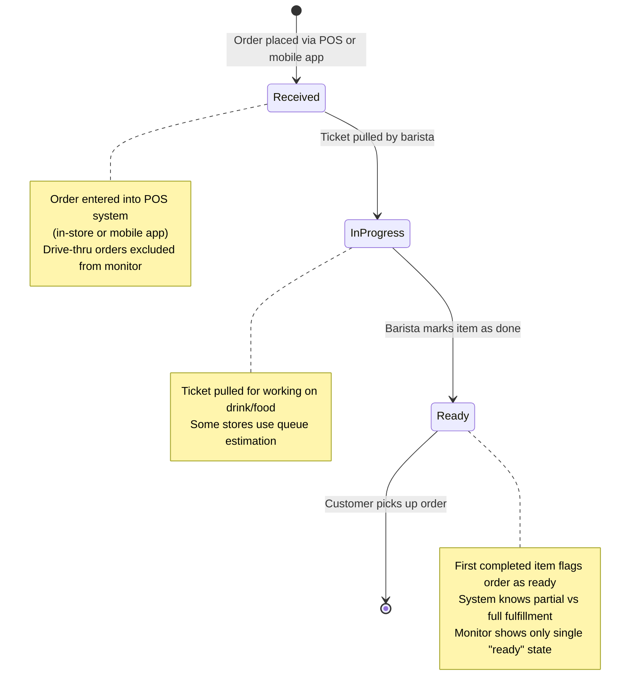

# Starbucks Order Status Case Study

## Overview

Starbucks' in-store order status monitors represent one of the most successful implementations of virtual queue management in retail. This case study analyzes their system to inform VirtualQ's design.

## System Components

### POS System (Oracle-based)
- Central hub for all transactions (in-store, mobile, drive-thru)
- Highly customized with business logic
- Integrates with mobile app and monitoring systems

### Order Status Monitors
- Wall-mounted displays near pickup areas
- Show customer names and order status
- Real-time updates from POS system
- Corporate stores with dedicated mobile order areas

### Mobile App Integration
- Order placement and customization
- Real-time status tracking
- Push notifications for status changes
- Store selection and pickup time estimation

### Barista Workflow
- Ticket printing system
- "Ticket pulling" triggers status changes
- Tablet-based completion marking
- Timer-based fallback for incomplete orders

## State Machine

## Key Insights

### What Works Well
- Clear visual status for customers
- Reduces "where's my order" questions
- Integrates seamlessly with existing POS
- Mobile app synchronization

### Operational Challenges
- Ticket pulling requires training (avoid bulk pulling)
- Barista forgets to mark items complete
- Partial order completion confusion
- Queue disruption when baristas leave mid-shift

### Design Decisions
- Single "ready" state vs. partial completion
- Drive-thru exclusion from monitors
- Customer name display (first name + last initial)
- Timer-based completion fallback

## Architecture Lessons

### Microservices Approach
- Order Service: Lifecycle management
- Menu Service: Item catalog and pricing
- Location Service: Store-specific inventory
- Notification Service: Real-time updates
- Payment Service: Transaction processing

### Event-Driven Updates
- Kafka/Redis for order status events
- WebSocket connections for real-time updates
- POS system publishes state changes
- Multiple consumers (monitors, mobile apps)

### Scalability Patterns
- Auto-scaling during peak hours
- CDN for static content (menu images)
- Multi-layer caching (Redis)
- Geospatial indexing for store location

## VirtualQ Implementation

### Direct Applications
- State machine model (received → in-progress → ready)
- Ticket-based workflow
- Real-time status broadcasting
- Employee completion tracking

### Enhancements
- Multi-tenant support
- Configurable state machines
- Custom ticket types beyond food orders
- Enhanced wait time estimation

### Avoided Pitfalls
- Bulk ticket pulling prevention
- Automatic completion fallbacks
- Clear partial completion handling
- Employee training considerations

## References

- [Enterprise Integration Patterns: Starbucks](https://www.enterpriseintegrationpatterns.com/ramblings/18_starbucks.html)
- [Starbucks Mobile Order & Pay Analysis](https://www.productmonk.io/p/starbucks-order-pay)
- [QSR Magazine: Mobile Ordering Challenges](https://www.qsrmagazine.com/story/the-fix-at-starbucks-had-to-start-with-mobile-ordering/)
- Personal interviews with Starbucks managers and baristas