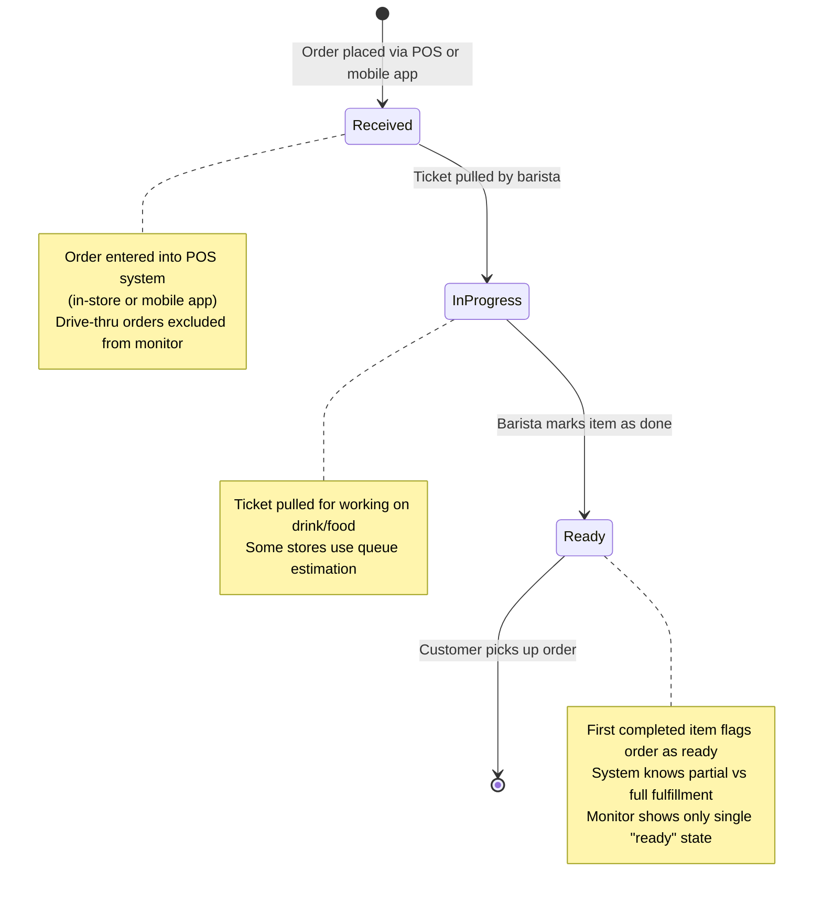

# The demo - New feature: Starbucks-like status screen 
One of the coolest automation features is the Starbucks monitors in some of the stores 
that shows the status of drinks as shown below:

At Starbucks, customers can watch their order status through the Starbucks mobile app and, the new in-store digital order status monitor. These systems provide real-time updates on when a mobile or in-store order is received, being prepared, and ready for pickup. This is especially useful when lots of orders are going on and lots of people standing around wondering where their order is.

*Note: Drive-thru orders are handled like in-store orders, but they are not shown on the monitors because it's presumed most drive-thru customers won't go inside the store*

## The demo work scope 
The demo assumes we have an architecture that is a parallel to Starbucks industry leading solution. It would
take a long time to rebuild all they have and some components we don't have access to (e.g. Oracle POS system).

We also don't want to build an entire solution of this size and magnitude from scratch, so we will simulate
a minimal subset of components of Starbuck's architecture to build a major feature. 

## Starbucks architecture topology

A highly simplified architecture topology we will simulate parts of is shown in the image below:

### Starbucks POS
The key component of Starbuck's architecture is a highly customized Oracle POS system. Starbucks spent a lot of time and money on putting business and operations logic into it. All transactions whether in-store orders at the register, online orders from their Apps or drive-thru orders all are processed by the Oracle POS. There are other apps and components in their architecture, but Oracle POS is the hub of their business solution operationally. 

We don't have an Oracle POS or one customized like theirs, so we will emulate a few simplified transactions with a simplified home-grown POS for this demo. 

### Starbucks Inventory System
Starbucks has an inventory system that is tied into all their stores. For purposes of store operations, the inventory needs to track the store's inventory where the order is placed. For example, if you're ordering on the mobile app, it reqiures you to pin your app's session to a specific Starbucks store so it can create and process an order. 

It appears that Starbucks pulls the inventory from a centralized system periodically, then caches that locally with what appears to be a long TTL (perhaps 24 hrs or on a daily scheduled refresh). 

*Note: I found an inventory problem with one of their products that the online app always said they are out of stock with Blueberries. I asked the Barista and they have blue berries. So she modified the inventory status on their store's POS. My order then could add blueberries. But the next day, no blueberries again. I asked the Barista and she said, yeah every day this happens and it does't keep my inventory update.*

### Inventory Service

From the store's perspective, this is limited to inventory only for the store where the orders are being fulfilled.

It's a complex system, but for our purposes we only need to be able to GET inventory level status for each item in the order. For testing purposes, we will include an endpoint also to alter an item's inventory level like they cand do with the POS in stores.

### Starbucks Operations Service

This handles various functions the POS doesn't cover. In our demo, the main 
function of Ops Service is to be provide the backend for the monitors. 
The operations service in our demo also has some endpoints for Barista app to do things like
force a reset of the in-store monitor state or remove an order from monitoring. 

### In-Store Monitors

These are just physical monitors. For the demo its a screen in a web browser. 
We will presume our solution uses React JS as the web app responsible for what the
in-store monitor shows to customers. 

### Starbucks Customer App

Starbucks has an award winning app for ordering. We will presume the reader is already familiar with it. 

### Starbucks Barista App

Starbucks has a tablet or mobile app that Baristas use. It appears to have a subset of POS features and is designed for Barista workflow. 

One use cases is when a drink is made. As the Barista finishes the drink or food item on the order, the Barista app is what they tap on to mark that item in the order as completed. The Barista app is key to how the monitor works as we'll see. 

*Note: I interviewed some store managers. One of them said the orders also have timers on them. After a certain amount of time, the order is presumed complete - in case the barista didn't mark it as complete*

### Starbucks "ticket pulling"

Their POS has a "ticket pulling" event handler. A ticket is the sticker you see on the drinks and food items they give the customer. This is how the Baristas track all the drinks, etc. when fulfilling the orders. 

A Starbucks ticket is shown below:

When a Barista pulls a ticket off their ticket printer, 
the pulling event is made available to the monitor solutions. Pulling the ticket means the order is no
"in progress". 

#### Starbucks operations aren't perfect, but the monitor tries to make it look perfect
One of the problems I was told during an interview is the ticket pulling requires employee training
because some people just pull a bunch of tickets to get one they want to handle, doing that it pushes
all those orders to "in-progress" status which confuses the customer and other baristas.

Generally, the cups or the tickets are lined up in a queue-like fashion as baristas process them
one at a time. If there was a single barista, it would be a perfect queue of orders processed. However, 
there are often multiple baristas pulling tickets so it's not a perfect queue, especially when a barista
leaves and the tickets are left unprocessed where they were working. 

Sometimes an order can't be processed as planned. Things break, they run out of supplies, etc. 
They are supposed to handle it by going back to the POS and cancelling / reordering things. 
When the barista follows the rules, the monitor is up to date. Note there is no "cancelled" 
area for orders, it relies upon the barista shouting out the customer's name and conversation. 

One common issue is a barista not marking an item as complete. When that happens it will mess up
the monitor's status if that was the only item in the order. It would show their order in a different state but never in "Ready" state. 

The monitor shows an order's status. But truth is each item in the order has a status. 
Since the monitor doesn't show that level of detail, they use the item that is furthest along 
as the order status the monitor shows to the customer. For example, if you ordered a coffee and a
sandwich, if the coffee was processed first then the sandwich a few minutes later, the customer
sees the status of the "cofffee" part of his order. The customer then wonders, "where's the rest
of my order". I asked the managers about that and it's common the barista gets interrupted with
that same question. It appears Starbucks thought a "partially ready" status on the monitor is too confusing 
for customers. 

All of these issues will be special cases for our requirements. 

### Mobile app order status

For all intensive purposes, the mobile app's order status is the same as the monitor's status in the
store. Instead of a monitor screen in the app, it uses mobile notifications.

The official Starbucks mobile app is the most common way for customers to track the progress of their mobile order and pay purchases. The app will provide notifications and display the status directly on your device. 

The mobile app status is beyond the scope of this demo. 

### The In-store order status monitors

In some Starbucks locations, particularly newer or recently remodeled stores, customers can view the status of their order on a digital screen near the pickup area. They are large screens mounted on a wall somewhere
typically inside the store.

**How it works:** 

These screens are tied to the store's digital order management system and display customer names (typically first name and last initial) with a status update. They are most commonly seen in corporate-owned stores with a dedicated area for handling mobile orders.

The online mobile app also is notified the order
is ready if that's what the customer used to create the order with. 

#### Drive-thru is special 
Note that drive-thru is special since the orders are completed in their entirety (rarely partially) plus
there are strict timers for how long a drive-thru takes. Normally, there are baristas assigned specifically to the drive-thru service.

Also, the drive-thru orders don't appear on the monitors inside the Starbucks because those customers
don't go in the store normally. 

#### What you'll see on the Order Status monitor:
 The monitor shows columns indicating the status of orders, such as "received," "in progress," and "ready".

 The state transitions:
 - **(start) -> received**: The order was entered into the POS system in person at the register, or mobile app. Note: drive-through does have an order status feature.

 - **received -> in progress**: The ticket is pulled for working on the drink or food item. Some stores change state by estimation of the queue of orders and time it takes to make the drinks.

 - **in progress -> ready**: The barista taps on a store tablet to mark the item as "done". The system knows if part or all of the order is fulfilled, but 
 the monitor has only a single "ready" state so the
 first item that is done flags the order "ready".

Note: The system is dependent on baristas manually marking orders as complete, so it may not always be perfectly synchronized with a customer receiving their order. 

Some customers report seeing their order listed as "ready" before it is, while others have seen the screen lag behind. The screen can help with managing expectations, but some customers note that it has not completely eliminated questions about order status

#### How starbucks updates order status

"Starbucks ticket pull" refers to the practice of baristas physically removing order tickets from the printer to organize drinks. While pulling a few tickets helps with sequencing, pulling too many at once can negatively affect mobile order estimated times and confuse customers, leading to potential issues with speed and accuracy. Recent policy shifts or regional mandates sometimes discourage pulling tickets onto the bar, preferring them to be kept on cups or within the system.  

## Key components of the system:

• Starbucks Mobile App: The primary interface for customers to browse the menu, customize orders, make payments, and track their rewards. For app design overview see: https://medium.com/@kimberly.d/exploring-three-ux-principles-that-make-the-starbucks-mobile-app-delightful-3e9f11fc6c5b 

• Custom POS System: Developed with Oracle, this system handles transactions at the store level, integrating seamlessly with the mobile app to transmit orders for preparation. 

• Backend Infrastructure: Starbucks uses Microsoft Azure for cloud services, supporting the app's AI features for personalization and managing data from various sources, including the IoT-enabled coffee machines. 

• Store Integration: The system allows customers to select a nearest store and a preferred pickup time, sending the order to that specific location for preparation. 

• Delivery Services: For delivery, Starbucks partners with third-party services like DoorDash, Uber Eats, and Grubhub to fulfill orders. 

• Customer Rewards: The POS and mobile app are integrated with the Starbucks Rewards program, managing customer loyalty and personalized offers. 

## Workflow for an Online Order:
1. Customer places order: Using the Starbucks app, a customer browses the menu, customizes their drink, selects a nearby store, and specifies a pickup time. 
2. Order transmission: The order details are sent from the app to the store's custom Oracle Point of Sale (POS) system. 
3. Payment processing: The customer's payment is processed through the integrated system. 
4. Order fulfillment: Baristas at the selected store receive and prepare the order. 
5. Pickup: The customer picks up their order at the designated store. 
6. Delivery (alternative): If the customer chooses delivery, the order is transmitted to a partner delivery service like DoorDash. 

## Eventing of order status

The Starbucks system could use Kafka or similar as an order status queue. 

# Summary
We are addressing the in-store monitor capability as a feature in this demo. One of the good challenges is that the solution to the feature requires modifying multiple components, which is likewise not uncommon for RCG's larger feature enhancements. 

The online ordering system for Starbucks must handle high traffic and complex custom orders while providing a low-latency, real-time experience. A microservices-based architecture is the ideal approach for ensuring scalability, resilience, and maintainability. 

---

# Solution Core components 

### Client applications 
The system's client-facing components would include the official Starbucks mobile app and website. 
	•	Mobile app: Built for both iOS and Android, allowing users to browse the menu, customize drinks, place orders, and manage rewards.
	•	Web app: Provides a similar experience through a web browser.
	•	Front-end services: A suite of services that manage user sessions, authentication, and communication with the back-end via APIs. 

### Microservices architecture 
To handle varying demands and reduce single points of failure, the back-end is broken down into independent, scalable microservices. 
	•	User service: Manages user registration, profiles, login, and authentication for both customers and staff.
	•	Menu service: Stores and manages the menu, including items, pricing, nutritional information, and customization options. This service handles the complex, nested logic for custom orders, such as adding extra shots or changing milk types.
	•	Location service: Stores Starbucks store information (e.g., address, hours, inventory) and uses geospatial data to recommend the nearest stores to a customer.
	•	Order service: Manages the entire lifecycle of an order, from placement to pickup. This service orchestrates complex transactions, including payment processing and inventory validation.
	•	Payment service: Integrates with payment gateways to process transactions and manage Starbucks gift card balances. It handles secure transactions and is PCI-compliant.
	•	Notification service: Sends real-time updates to customers via push notifications or SMS regarding their order status (e.g., "Order received," "Order ready").
	•	Loyalty and rewards service: Tracks customer loyalty points, manages rewards, and provides personalized offers. 

### Back-end infrastructure and data flow 
	1	Request from a client: A user's request from the mobile app is sent to the back-end via an API Gateway.
	2	API Gateway: This gateway acts as a single entry point for all client requests and forwards them to the appropriate microservice. It also handles authentication and rate limiting.
	3	Order placement:
	◦	The Order Service accepts the user's order and validates it against the Menu Service for accuracy and pricing.
	◦	It then checks the Location Service for the selected store's operational hours and current status.
	◦	The request is handed off to the Payment Service for transaction processing.
	4	Asynchronous processing: The system uses message queues (e.g., Kafka) to manage the flow of orders.
	◦	Once a payment is approved, the Order Service pushes an event to the queue.
	◦	The store's Point-of-Sale (POS) system consumes this event, and the order appears on the barista's screen.
	5	Real-time status updates:
	◦	The Notification Service consumes events from the queue and sends status updates to the customer.
	◦	The client app can use WebSockets to maintain a real-time connection for instant order tracking.
	6	Data storage:
	◦	PostgreSQL/MySQL: A relational database is used by microservices like the User Service and Menu Service to store structured data.
	◦	Redis/in-memory cache: Used for caching frequently accessed data, such as popular menu items, to reduce database load and improve response times.
	◦	Elasticsearch: A NoSQL database is used for fast, flexible searching of menu items. 

### Scalability and performance considerations
	•	Auto-scaling: The microservices architecture, managed by an orchestrator like Kubernetes, allows the system to automatically scale services up or down based on demand, such as during morning and afternoon rushes.
	•	Content Delivery Network (CDN): A CDN is used to cache static content like menu images to reduce latency for global users.
	•	Caching: A multi-layered caching strategy, using services like Redis, reduces the load on the database by serving popular menu items and user data from memory.
	•	Geospatial indexing: To quickly find nearby stores, the Location Service can use a geospatial indexing system like Geohashing.
	•	Distributed transactions: Orders involving multiple services (e.g., deducting payment, updating inventory) are handled with robust transaction management to ensure data consistency, even if a part of the system fails.
	•	Data replication: Databases are replicated across multiple availability zones to ensure high availability and prevent data loss. 

### Key system flows

Placing an order
	1	Customer Action: A customer adds a customized item to their cart via the mobile app.
	2	API Call: The app sends a POST /api/v1/orders request to the API Gateway.
	3	Service Interaction: The API Gateway routes the request to the Order Service. The service validates the order with the Menu Service.
	4	Payment and Cart: The Order Service interacts with the Payment Service to process the transaction. The user's cart is stored in a temporary, session-based storage or in a database until the order is finalized.
	5	Queueing: Once paid, the Order Service publishes an order event to a Kafka queue.
	6	Notification: The Notification Service consumes the event and sends a push notification to the customer ("Your order has been received!").
	7	Store Fulfillment: The store's POS system consumes the order event from the queue and displays it to the barista. 

Order status tracking
	1	Real-time Connection: The customer's app establishes a WebSocket connection to the Notification Service.
	2	Barista Action: The barista updates the order status on their POS system (e.g., "In Progress," "Ready for Pickup").
	3	Event Publishing: The POS system publishes an event with the new status to the Kafka queue.
	4	Push Notification: The Notification Service consumes the event and sends a push notification to the customer ("Your order is ready!").
	5	App Update: The real-time status is also updated on the user's app interface
Resources

Scalability and performance considerations 
	•	Auto-scaling: The microservices architecture, managed by an orchestrator like Kubernetes, allows the system to automatically scale services up or down based on demand, such as during morning and afternoon rushes.
	•	Content Delivery Network (CDN): A CDN is used to cache static content like menu images to reduce latency for global users.
	•	Caching: A multi-layered caching strategy, using services like Redis, reduces the load on the database by serving popular menu items and user data from memory.
	•	Geospatial indexing: To quickly find nearby stores, the Location Service can use a geospatial indexing system like Geohashing.
	•	Distributed transactions: Orders involving multiple services (e.g., deducting payment, updating inventory) are handled with robust transaction management to ensure data consistency, even if a part of the system fails.
	•	Data replication: Databases are replicated across multiple availability zones to ensure high availability and prevent data loss. 

Key system flows 

Placing an order 
	1	Customer Action: A customer adds a customized item to their cart via the mobile app.
	2	API Call: The app sends a POST /api/v1/orders request to the API Gateway.
	3	Service Interaction: The API Gateway routes the request to the Order Service. The service validates the order with the Menu Service.
	4	Payment and Cart: The Order Service interacts with the Payment Service to process the transaction. The user's cart is stored in a temporary, session-based storage or in a database until the order is finalized.
	5	Queueing: Once paid, the Order Service publishes an order event to a Kafka queue.
	6	Notification: The Notification Service consumes the event and sends a push notification to the customer ("Your order has been received!").
	7	Store Fulfillment: The store's POS system consumes the order event from the queue and displays it to the barista. 

Order status tracking 
	1	Real-time Connection: The customer's app establishes a WebSocket connection to the Notification Service.
	2	Barista Action: The barista updates the order status on their POS system (e.g., "In Progress," "Ready for Pickup").
	3	Event Publishing: The POS system publishes an event with the new status to the Kafka queue.
	4	Push Notification: The Notification Service consumes the event and sends a push notification to the customer ("Your order is ready!").
	5	App Update: The real-time status is also updated on the user's app interface. 

AI can make mistakes, so double-check response

# Resources  

- [Famous Starbucks article]( https://www.enterpriseintegrationpatterns.com/ramblings/18_starbucks.html)

- [Good database schema example]( https://deprep.substack.com/p/prep-15-designing-a-coffee-shop-database)

- [How Starbuck's Mobile Order & Pay helps enhance customer experiences](https://www.productmonk.io/p/starbucks-order-pay)

- [Starbucks’ POS System: Everything You Need To Know](https://koronapos.com/blog/starbucks-pos-system/)

- [Starbucks POS – How They Optimize This System to Remain World’s Leading Coffee Company for Decades](https://www.connectpos.com/starbuck-pos/)

- [Data flow starbucks online ordering](https://docs.google.com/document/d/1rte8yyJsMXa3VJJY2XNmkxnixfATEAa7BooTvGKRZXg/preview?hgd=1&tab=t.0)

- [Article: starbucks battle between counter orders, mobile orders and drive-thru orders](https://www.qsrmagazine.com/story/the-fix-at-starbucks-had-to-start-with-mobile-ordering/#:~:text=Starbucks%20also%20started%20to%20test,not%20having%20a%20sequencing%20system.)

- [a simple order tracking system](https://medium.com/@ankitviddya/design-an-order-tracking-system-7ddfbe3476d9)

- [Starbucks digital innovation](https://www.from.digital/insights/how-starbucks-made-ordering-coffee-digital-innovation/)

- [Forbes: Starbucks pickup only store](https://www.forbes.com/sites/christopherwalton/2020/01/28/starbucks-pickup-only-store-is-a-spectacular-glimpse-into-the-future-of-embedded-retail/)

- [Brian McGinnis] - Personal interviews with Starbucks managers and Baristas

- https://medium.com/@ankitviddya/design-an-order-tracking-system-7ddfbe3476d9

- https://www.from.digital/insights/how-starbucks-made-ordering-coffee-digital-innovation/

- https://www.forbes.com/sites/christopherwalton/2020/01/28/starbucks-pickup-only-store-is-a-spectacular-glimpse-into-the-future-of-embedded-retail/
